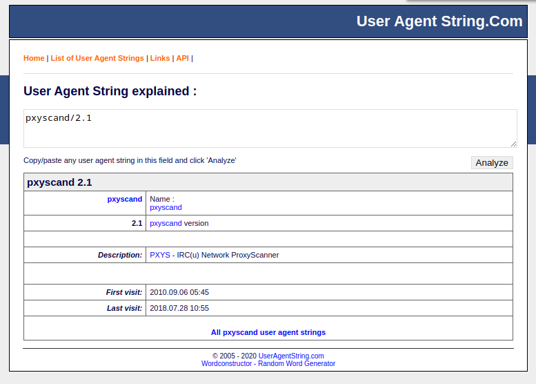

# Hammered

## Info

- Category : Digital Forensics
- SHA1SUM : c5282824e485cbafe4b13a942759fd6720433929
- Published : Oct. 25, 2020, midnight
- Author : The HoneyNet Project
- Size : 944 KB
- Tags : Apache2 Honeypot Log Analysis WebServer

Unzip the challenge (pass: cyberdefenders.org), examine artifacts, and answer the provided questions.

### Challenge Files

- kern.log
- auth.log
- daemon.log
- dmesg
- apache2

### Challenge

This challenge takes you into the world of virtual systems and confusing log data. In this challenge, as a soc analyst figure out what happened to this webserver honeypot using the logs from a possibly compromised server.

---

## Questions

### Q1 - Which service did the attackers use to gain access to the system?

We have several log files including the apache and auth.log logs (which contain the ssh). These are in my opinion the 2 most likely entry points.

```shell
grep -i "failure" auth.log | wc -l
20360
```

We can see lot of failed attempts in `auth.log`. We can deduce a ssh bruteforce.

**Answer : ssh**

### Q2 - What is the operating system version of the targeted system? (one word)

```shell
less kern.log

Mar 16 08:09:58 app-1 kernel: Inspecting /boot/System.map-2.6.24-26-server
Mar 16 08:09:58 app-1 kernel: Loaded 28787 symbols from /boot/System.map-2.6.24-26-server.
Mar 16 08:09:58 app-1 kernel: Symbols match kernel version 2.6.24.
Mar 16 08:09:58 app-1 kernel: Loaded 14773 symbols from 62 modules.
Mar 16 08:09:58 app-1 kernel: [    0.000000] Initializing cgroup subsys cpuset
Mar 16 08:09:58 app-1 kernel: [    0.000000] Initializing cgroup subsys cpu
Mar 16 08:09:58 app-1 kernel: [    0.000000] Linux version 2.6.24-26-server (buildd@crested) (gcc version 4.2.4 (Ubuntu 4.2.4-1ubuntu3)) #1 SMP Tue Dec 1 18:26:43 UTC 2009 (Ubuntu 2.6.24-26.64-server)
Mar 16 08:09:58 app-1 kernel: [    0.000000] Command line: root=UUID=a691743a-a4b7-482d-95ff-406e5acd83a3 ro quiet splash
Mar 16 08:09:58 app-1 kernel: [    0.000000] BIOS-provided physical RAM map:
```

**Answer : 4.2.4-1ubuntu3**

### Q3 - What is the name of the compromised account?

```shell
cat auth.log | grep "Accepted password"

Mar 16 08:26:06 app-1 sshd[4894]: Accepted password for user3 from 192.168.126.1 port 61474 ssh2
Mar 16 10:14:02 app-1 sshd[5142]: Accepted password for user3 from 192.168.126.1 port 62897 ssh2
Mar 16 17:12:24 app-1 sshd[5513]: Accepted password for user3 from 192.168.126.1 port 63555 ssh2
Mar 18 09:42:22 app-1 sshd[4693]: Accepted password for user3 from 10.0.1.2 port 64721 ssh2
Mar 18 10:00:10 app-1 sshd[4764]: Accepted password for user1 from 76.191.195.140 port 35226 ssh2
Mar 18 10:00:30 app-1 sshd[4786]: Accepted password for user3 from 10.0.1.2 port 64950 ssh2
Mar 18 11:39:50 app-1 sshd[10158]: Accepted password for user2 from 71.132.129.212 port 34333 ssh2
Mar 18 11:40:56 app-1 sshd[10200]: Accepted password for user2 from 71.132.129.212 port 40961 ssh2
Mar 18 11:41:43 app-1 sshd[10224]: Accepted password for user2 from 71.132.129.212 port 41661 ssh2
Mar 18 11:48:16 app-1 sshd[10253]: Accepted password for user1 from 76.191.195.140 port 43613 ssh2
Mar 18 11:51:31 app-1 sshd[10294]: Accepted password for user2 from 71.132.129.212 port 41296 ssh2
Mar 18 11:59:43 app-1 sshd[10333]: Accepted password for user3 from 10.0.1.2 port 49873 ssh2
Mar 18 15:15:28 app-1 sshd[13419]: Accepted password for user1 from 76.191.195.140 port 46152 ssh2
Mar 18 16:25:51 app-1 sshd[14393]: Accepted password for user1 from 76.191.195.140 port 39656 ssh2
Mar 23 09:17:57 app-1 sshd[5478]: Accepted password for user3 from 10.0.1.2 port 58677 ssh2
Mar 23 12:12:11 app-1 sshd[6028]: Accepted password for user3 from 10.0.1.2 port 61047 ssh2
Mar 23 14:00:38 app-1 sshd[6266]: Accepted password for user1 from 76.191.195.140 port 34923 ssh2
Mar 23 14:07:23 app-1 sshd[6351]: Accepted password for user1 from 76.191.195.140 port 37018 ssh2
Mar 23 14:18:06 app-1 sshd[6627]: Accepted password for user1 from 76.191.195.140 port 33563 ssh2
Mar 23 18:02:29 app-1 sshd[7224]: Accepted password for user2 from 71.132.129.212 port 46820 ssh2
Mar 24 05:48:46 app-1 sshd[7477]: Accepted password for user1 from 208.80.69.74 port 33259 ssh2
Mar 24 06:37:11 app-1 sshd[15437]: Accepted password for user3 from 208.80.69.74 port 33333 ssh2
Mar 24 21:12:19 app-1 sshd[17916]: Accepted password for user1 from 76.191.195.140 port 36112 ssh2
Mar 24 21:19:02 app-1 sshd[17968]: Accepted password for user1 from 76.191.195.140 port 36804 ssh2
Mar 25 12:11:19 app-1 sshd[5305]: Accepted password for user3 from 10.0.1.2 port 50896 ssh2
Mar 26 14:58:37 app-1 sshd[9598]: Accepted password for user1 from 166.129.196.88 port 64620 ssh2
Mar 28 14:33:50 app-1 sshd[17128]: Accepted password for user3 from 10.0.1.2 port 60617 ssh2
Mar 29 13:17:53 app-1 sshd[21426]: Accepted password for user1 from 76.191.195.140 port 40738 ssh2
Mar 29 13:24:07 app-1 sshd[21494]: Accepted password for user3 from 10.0.1.2 port 51773 ssh2
Mar 29 13:27:26 app-1 sshd[21556]: Accepted password for root from 10.0.1.2 port 51784 ssh2
Mar 29 23:39:05 app-1 sshd[26248]: Accepted password for user1 from 76.191.195.140 port 40654 ssh2
Mar 30 13:30:17 app-1 sshd[28893]: Accepted password for user1 from 208.80.69.74 port 33042 ssh2
Apr  1 11:20:58 app-1 sshd[4168]: Accepted password for user1 from 67.164.72.181 port 63021 ssh2
Apr  1 16:23:04 app-1 sshd[5001]: Accepted password for user3 from 10.0.1.2 port 53337 ssh2
Apr  1 21:12:32 app-1 sshd[6684]: Accepted password for user1 from 76.191.195.140 port 47887 ssh2
Apr  2 07:20:50 app-1 sshd[10339]: Accepted password for user1 from 76.191.195.140 port 45649 ssh2
Apr  2 12:42:31 app-1 sshd[12534]: Accepted password for user1 from 76.191.195.140 port 34591 ssh2
Apr 14 14:46:01 app-1 sshd[5738]: Accepted password for user1 from 65.195.182.120 port 57897 ssh2
Apr 14 14:51:05 app-1 sshd[5816]: Accepted password for user3 from 65.195.182.120 port 52414 ssh2
Apr 15 12:02:55 app-1 sshd[9418]: Accepted password for user1 from 208.80.69.74 port 33553 ssh2
Apr 15 14:43:56 app-1 sshd[10122]: Accepted password for user1 from 208.80.69.74 port 33777 ssh2
Apr 15 14:47:53 app-1 sshd[10174]: Accepted password for user1 from 208.80.69.74 port 33737 ssh2
Apr 15 19:48:38 app-1 sshd[12230]: Accepted password for user1 from 76.191.195.140 port 33880 ssh2
Apr 15 20:19:03 app-1 sshd[12687]: Accepted password for user1 from 76.191.195.140 port 38422 ssh2
Apr 15 20:29:16 app-1 sshd[12813]: Accepted password for user1 from 76.191.195.140 port 39747 ssh2
Apr 16 09:35:19 app-1 sshd[15290]: Accepted password for user1 from 76.191.195.140 port 33041 ssh2
Apr 18 18:07:35 app-1 sshd[5152]: Accepted password for user3 from 10.0.1.2 port 49576 ssh2
Apr 18 18:08:46 app-1 sshd[5173]: Accepted password for user3 from 10.0.1.2 port 49587 ssh2
Apr 18 18:29:30 app-1 sshd[5302]: Accepted password for user3 from 10.0.1.4 port 61340 ssh2
Apr 18 20:35:34 app-1 sshd[5614]: Accepted password for user3 from 10.0.1.4 port 61902 ssh2
Apr 18 21:52:03 app-1 sshd[5836]: Accepted password for user3 from 10.0.1.4 port 62023 ssh2
Apr 18 21:53:28 app-1 sshd[5856]: Accepted password for user3 from 10.0.1.4 port 62027 ssh2
Apr 19 05:41:44 app-1 sshd[8810]: Accepted password for root from 219.150.161.20 port 51249 ssh2
Apr 19 05:42:27 app-1 sshd[9031]: Accepted password for root from 219.150.161.20 port 40877 ssh2
Apr 19 05:55:20 app-1 sshd[12996]: Accepted password for root from 219.150.161.20 port 55545 ssh2
Apr 19 05:56:05 app-1 sshd[13218]: Accepted password for root from 219.150.161.20 port 36585 ssh2
Apr 19 09:59:27 app-1 sshd[27143]: Accepted password for user1 from 76.191.195.140 port 40961 ssh2
Apr 19 09:59:35 app-1 sshd[27163]: Accepted password for user1 from 76.191.195.140 port 44689 ssh2
Apr 19 10:45:36 app-1 sshd[28030]: Accepted password for root from 222.66.204.246 port 48208 ssh2
Apr 19 10:46:50 app-1 sshd[28272]: Accepted password for user1 from 208.80.69.74 port 33544 ssh2
Apr 19 11:03:44 app-1 sshd[30277]: Accepted password for root from 201.229.176.217 port 54465 ssh2
Apr 19 11:15:26 app-1 sshd[30364]: Accepted password for root from 190.167.70.87 port 49497 ssh2
Apr 19 11:58:00 app-1 sshd[30837]: Accepted password for user3 from 208.80.69.69 port 37409 ssh2
Apr 19 14:28:32 app-1 sshd[32633]: Accepted password for user3 from 208.80.69.69 port 44041 ssh2
Apr 19 17:22:52 app-1 sshd[892]: Accepted password for user1 from 76.191.195.140 port 36639 ssh2
Apr 19 17:28:05 app-1 sshd[950]: Accepted password for user1 from 76.191.195.140 port 34472 ssh2
Apr 19 18:13:49 app-1 sshd[1158]: Accepted password for user3 from 10.0.1.2 port 59387 ssh2
Apr 19 22:37:24 app-1 sshd[2012]: Accepted password for root from 190.166.87.164 port 50753 ssh2
Apr 19 22:46:10 app-1 sshd[2060]: Accepted password for dhg from 190.166.87.164 port 50950 ssh2
Apr 19 22:54:06 app-1 sshd[2149]: Accepted password for root from 190.166.87.164 port 51101 ssh2
Apr 19 23:02:25 app-1 sshd[2210]: Accepted password for root from 190.166.87.164 port 51303 ssh2
Apr 19 23:04:46 app-1 sshd[2376]: Accepted password for dhg from 190.166.87.164 port 51304 ssh2
Apr 20 00:00:51 app-1 sshd[24440]: Accepted password for dhg from 190.166.87.164 port 52422 ssh2
Apr 20 00:55:05 app-1 sshd[24805]: Accepted password for dhg from 190.166.87.164 port 52812 ssh2
Apr 20 06:12:41 app-1 sshd[26686]: Accepted password for dhg from 190.166.87.164 port 53460 ssh2
Apr 20 06:13:03 app-1 sshd[26712]: Accepted password for root from 121.11.66.70 port 33828 ssh2
Apr 20 06:46:03 app-1 sshd[29540]: Accepted password for dhg from 190.166.87.164 port 53601 ssh2
Apr 20 07:22:01 app-1 sshd[29996]: Accepted password for dhg from 190.166.87.164 port 54059 ssh2
Apr 20 10:48:35 app-1 sshd[30616]: Accepted password for dhg from 190.166.87.164 port 58201 ssh2
Apr 20 12:02:48 app-1 sshd[30798]: Accepted password for dhg from 190.166.87.164 port 58839 ssh2
Apr 20 12:10:29 app-1 sshd[30820]: Accepted password for dhg from 190.166.87.164 port 58850 ssh2
Apr 20 12:26:08 app-1 sshd[30892]: Accepted password for dhg from 190.166.87.164 port 59033 ssh2
Apr 20 12:27:29 app-1 sshd[30896]: Accepted password for dhg from 190.166.87.164 port 59036 ssh2
Apr 20 19:16:57 app-1 sshd[32196]: Accepted password for dhg from 190.166.87.164 port 58137 ssh2
Apr 20 19:18:45 app-1 sshd[32210]: Accepted password for dhg from 190.166.87.164 port 58276 ssh2
Apr 20 21:38:52 app-1 sshd[32580]: Accepted password for dhg from 190.166.87.164 port 51379 ssh2
Apr 20 21:46:28 app-1 sshd[32611]: Accepted password for dhg from 190.166.87.164 port 51683 ssh2
Apr 21 08:08:14 app-1 sshd[1885]: Accepted password for dhg from 190.166.87.164 port 54769 ssh2
Apr 21 11:51:38 app-1 sshd[2649]: Accepted password for root from 193.1.186.197 port 38318 ssh2
Apr 21 11:56:37 app-1 sshd[2686]: Accepted password for root from 151.81.205.100 port 54272 ssh2
Apr 21 17:17:00 app-1 sshd[3542]: Accepted password for dhg from 190.166.87.164 port 54300 ssh2
Apr 21 17:31:16 app-1 sshd[3585]: Accepted password for dhg from 190.166.87.164 port 54374 ssh2
Apr 21 18:25:42 app-1 sshd[3747]: Accepted password for dhg from 190.166.87.164 port 54919 ssh2
Apr 22 01:30:27 app-1 sshd[4877]: Accepted password for root from 151.82.3.201 port 49249 ssh2
Apr 22 06:41:38 app-1 sshd[5876]: Accepted password for root from 151.81.204.141 port 59064 ssh2
Apr 22 08:29:12 app-1 sshd[7443]: Accepted password for user1 from 65.88.2.5 port 1459 ssh2
Apr 22 10:00:04 app-1 sshd[7709]: Accepted password for user1 from 65.88.2.5 port 51190 ssh2
Apr 22 11:02:15 app-1 sshd[7940]: Accepted password for root from 222.169.224.197 port 45356 ssh2
Apr 22 11:09:29 app-1 sshd[8490]: Accepted password for user1 from 65.88.2.5 port 12325 ssh2
Apr 22 12:34:19 app-1 sshd[9828]: Accepted password for user1 from 65.88.2.5 port 53044 ssh2
Apr 22 12:51:16 app-1 sshd[10196]: Accepted password for user1 from 65.88.2.5 port 17012 ssh2
Apr 23 03:11:03 app-1 sshd[13633]: Accepted password for root from 122.226.202.12 port 40892 ssh2
Apr 23 03:20:41 app-1 sshd[13930]: Accepted password for root from 122.226.202.12 port 40209 ssh2
Apr 23 07:33:49 app-1 sshd[15557]: Accepted password for user1 from 65.88.2.5 port 6358 ssh2
Apr 23 11:31:04 app-1 sshd[16761]: Accepted password for user3 from 10.0.1.2 port 50999 ssh2
Apr 24 11:36:19 app-1 sshd[24436]: Accepted password for root from 121.11.66.70 port 58832 ssh2
Apr 24 15:28:37 app-1 sshd[31338]: Accepted password for root from 61.168.227.12 port 43770 ssh2
Apr 24 16:33:36 app-1 sshd[31845]: Accepted password for root from 188.131.22.69 port 1844 ssh2
Apr 24 18:46:57 app-1 sshd[32211]: Accepted password for dhg from 190.167.74.184 port 60271 ssh2
Apr 24 19:15:54 app-1 sshd[32299]: Accepted password for root from 190.167.74.184 port 60992 ssh2
Apr 24 20:23:04 app-1 sshd[5764]: Accepted password for dhg from 190.167.74.184 port 65081 ssh2
Apr 25 10:38:56 app-1 sshd[9560]: Accepted password for root from 94.52.185.9 port 59821 ssh2
Apr 25 12:21:39 app-1 sshd[10826]: Accepted password for fido from 94.52.185.9 port 60189 ssh2
Apr 26 04:42:55 app-1 sshd[20096]: Accepted password for root from 188.131.23.37 port 3527 ssh2
Apr 26 04:59:02 app-1 sshd[20491]: Accepted password for root from 188.131.23.37 port 3561 ssh2
Apr 26 08:47:28 app-1 sshd[23501]: Accepted password for root from 188.131.23.37 port 4271 ssh2
Apr 26 08:51:50 app-1 sshd[23542]: Accepted password for root from 188.131.23.37 port 4280 ssh2
Apr 26 09:35:14 app-1 sshd[23968]: Accepted password for user1 from 208.80.69.70 port 33371 ssh2
```

**Answer : root**

### Q4 - Consider that each unique IP represents a different attacker. How many attackers were able to get access to the system?

```shell
cat auth.log | grep "Accepted password for root" | cut -d " " -f 11 | sort -u | wc -l
18
```

The sort command is used to sort the IP addresses in a given list. The -u option tells sort to display only unique lines, removing any duplicate IP addresses.

18 is not the correct answer. People with legitimate access can also mistype their passwords. We deduced an ssh bruteforce attack. So we need to know which IP address received the most failed attempts.

```shell
cat auth.log | grep "Accepted password for root" | cut -d " " -f 11 | sort -u > ips.txt
```

```sh
#!/bin/bash

ips_files="ips.txt"

# loops to read the file line by line
while IFS= read -r line; do
    attempts_by_ip=`cat auth.log | grep "authentication failure" | grep $line | wc -l`
    echo "$line : $attempts_by_ip"
done < "$ips_files"
```

```shell
./get_attacker_IPs.sh 
10.0.1.2 : 0
121.11.66.70 : 1435
122.226.202.12 : 513
151.81.204.141 : 0
151.81.205.100 : 0
151.82.3.201 : 0
188.131.22.69 : 0
188.131.23.37 : 2
190.166.87.164 : 3
190.167.70.87 : 0
190.167.74.184 : 0
193.1.186.197 : 0
201.229.176.217 : 0
219.150.161.20 : 9259
222.169.224.197 : 646
222.66.204.246 : 1573
61.168.227.12 : 213
94.52.185.9 : 1
```

**Answer : 6**

### Q5 - Which attacker's IP address successfully logged into the system the most number of times?

We take the same script and just modify the **grep** instruction :

```sh
#!/bin/bash

ips_files="ips.txt"

# loops to read the file line by line
while IFS= read -r line; do
    attempts_by_ip=`cat auth.log | grep "Accepted password for root" | grep $line | wc -l`
    echo "$line : $attempts_by_ip"
done < "$ips_files"
```

```shell
./get_attacker_IPs_success.sh

10.0.1.2 : 1
121.11.66.70 : 2
122.226.202.12 : 2
151.81.204.141 : 1
151.81.205.100 : 1
151.82.3.201 : 1
188.131.22.69 : 1
188.131.23.37 : 4
190.166.87.164 : 3
190.167.70.87 : 1
190.167.74.184 : 1
193.1.186.197 : 1
201.229.176.217 : 1
219.150.161.20 : 4
222.169.224.197 : 1
222.66.204.246 : 1
61.168.227.12 : 1
94.52.185.9 : 1
```

2 possible choices :

```shell
188.131.23.37 : 4
219.150.161.20 : 4
```

**Answer : 219.150.161.20**

### Q6 - How many requests were sent to the Apache Server?

```shell
cat Hammered/apache2/www-access.log| wc -l
365
```

**Answer : 365**

### Q7 - How many rules have been added to the firewall?

```shell
grep -r "ufw allow"

auth.log:Apr 20 06:51:38 app-1 sudo:     root : TTY=pts/2 ; PWD=/home/dhg/eggdrop ; USER=root ; COMMAND=/usr/sbin/ufw allow 113/Identd
auth.log:Apr 20 06:52:06 app-1 sudo:     root : TTY=pts/2 ; PWD=/home/dhg/eggdrop ; USER=root ; COMMAND=/usr/sbin/ufw allow 113/identd
auth.log:Apr 20 06:52:15 app-1 sudo:     root : TTY=pts/2 ; PWD=/home/dhg/eggdrop ; USER=root ; COMMAND=/usr/sbin/ufw allow 113
auth.log:Apr 20 06:52:26 app-1 sudo:     root : TTY=pts/2 ; PWD=/home/dhg/eggdrop ; USER=root ; COMMAND=/usr/sbin/ufw allow 53
auth.log:Apr 20 06:58:19 app-1 sudo:     root : TTY=pts/2 ; PWD=/home/dhg/eggdrop ; USER=root ; COMMAND=/usr/sbin/ufw allow 0303 telnet
auth.log:Apr 20 06:58:42 app-1 sudo:     root : TTY=pts/2 ; PWD=/home/dhg/eggdrop ; USER=root ; COMMAND=/usr/sbin/ufw allow 22
auth.log:Apr 20 06:58:57 app-1 sudo:     root : TTY=pts/2 ; PWD=/home/dhg/eggdrop ; USER=root ; COMMAND=/usr/sbin/ufw allow 53
auth.log:Apr 20 06:59:02 app-1 sudo:     root : TTY=pts/2 ; PWD=/home/dhg/eggdrop ; USER=root ; COMMAND=/usr/sbin/ufw allow 113
auth.log:Apr 20 07:06:11 app-1 sudo:     root : TTY=pts/2 ; PWD=/home/dhg/eggdrop ; USER=root ; COMMAND=/usr/sbin/ufw allow 2685/tcp
auth.log:Apr 20 07:06:22 app-1 sudo:     root : TTY=pts/2 ; PWD=/home/dhg/eggdrop ; USER=root ; COMMAND=/usr/sbin/ufw allow 2685/telnet
auth.log:Apr 24 19:47:48 app-1 sudo:     root : TTY=pts/2 ; PWD=/etc ; USER=root ; COMMAND=/usr/sbin/ufw allow 53
auth.log:Apr 24 19:47:56 app-1 sudo:     root : TTY=pts/2 ; PWD=/etc ; USER=root ; COMMAND=/usr/sbin/ufw allow 113
```

```shell
grep -r "ufw allow" auth.log | awk -F "COMMAND=/usr/sbin/" '{print $2}' | sort -f -u
ufw allow 0303 telnet # don't take this
ufw allow 113
ufw allow 113/Identd
ufw allow 22
ufw allow 2685/tcp
ufw allow 2685/telnet
ufw allow 53
```

**Answer : 6**

### Q8 - One of the downloaded files to the target system is a scanning tool. Provide the tool name.

You can grep on known tool names in the apt logs :

```shell
cat apt/term.log | grep -i nmap

Selecting previously deselected package nmap.
Unpacking nmap (from .../archives/nmap_4.53-3_amd64.deb) ...
Setting up nmap (4.53-3) ...
```

**Answer : nmap**

### Q9 - When was the last login from the attacker with IP 219.150.161.20? Format: MM/DD/YYYY HH:MM:SS AM

```shell
grep -i "219.150.161.20" auth.log | grep "Accepted password for root"

Apr 19 05:41:44 app-1 sshd[8810]: Accepted password for root from 219.150.161.20 port 51249 ssh2
Apr 19 05:42:27 app-1 sshd[9031]: Accepted password for root from 219.150.161.20 port 40877 ssh2
Apr 19 05:55:20 app-1 sshd[12996]: Accepted password for root from 219.150.161.20 port 55545 ssh2
Apr 19 05:56:05 app-1 sshd[13218]: Accepted password for root from 219.150.161.20 port 36585 ssh2
```

```shell
ls -l auth.log 
-rw-r----- 1 zarkyo zarkyo 10327345  3 juil.  2010 auth.log
```

**Answer : 04/19/2010 05:56:05 AM**

### Q10 - The database displayed two warning messages, provide the most important and dangerous one.

```shell
grep -ri "maria" 

auth.log:Apr 19 05:44:53 app-1 sshd[9782]: Invalid user anamaria from 219.150.161.20
auth.log:Apr 19 05:44:56 app-1 sshd[9782]: Failed password for invalid user anamaria from 219.150.161.20 port 37783 ssh2
auth.log:Apr 19 05:47:30 app-1 sshd[10602]: Invalid user marias from 219.150.161.20
auth.log:Apr 19 05:47:32 app-1 sshd[10602]: Failed password for invalid user marias from 219.150.161.20 port 50291 ssh2
[...]
```

```shell
grep -ri "mysql" 

grep -ri "mysql" | grep -i warning
daemon.log:Mar 18 10:18:42 app-1 /etc/mysql/debian-start[7566]: WARNING: mysql.user contains 2 root accounts without password!
daemon.log:Mar 18 17:01:44 app-1 /etc/mysql/debian-start[14717]: WARNING: mysql.user contains 2 root accounts without password!
daemon.log:Mar 22 13:49:49 app-1 /etc/mysql/debian-start[5599]: WARNING: mysql.user contains 2 root accounts without password!
daemon.log:Mar 22 18:43:41 app-1 /etc/mysql/debian-start[4755]: WARNING: mysql.user contains 2 root accounts without password!
daemon.log:Mar 22 18:45:25 app-1 /etc/mysql/debian-start[4749]: WARNING: mysql.user contains 2 root accounts without password!
daemon.log:Mar 25 11:56:53 app-1 /etc/mysql/debian-start[4848]: WARNING: mysql.user contains 2 root accounts without password!
daemon.log:Apr 14 14:44:34 app-1 /etc/mysql/debian-start[5369]: WARNING: mysql.user contains 2 root accounts without password!
daemon.log:Apr 14 14:44:36 app-1 /etc/mysql/debian-start[5624]: WARNING: mysqlcheck has found corrupt tables
daemon.log:Apr 18 18:04:00 app-1 /etc/mysql/debian-start[4647]: WARNING: mysql.user contains 2 root accounts without password!
daemon.log:Apr 24 20:21:24 app-1 /etc/mysql/debian-start[5427]: WARNING: mysql.user contains 2 root accounts without password!
daemon.log:Apr 28 07:34:26 app-1 /etc/mysql/debian-start[4782]: WARNING: mysql.user contains 2 root accounts without password!
daemon.log:Apr 28 07:34:27 app-1 /etc/mysql/debian-start[5032]: WARNING: mysqlcheck has found corrupt tables
daemon.log:Apr 28 07:34:27 app-1 /etc/mysql/debian-start[5032]: warning  : 1 client is using or hasn't closed the table properly
daemon.log:Apr 28 07:34:27 app-1 /etc/mysql/debian-start[5032]: warning  : 1 client is using or hasn't closed the table properly
daemon.log:May  2 23:05:54 app-1 /etc/mysql/debian-start[4774]: WARNING: mysql.user contains 2 root accounts without password!
```

**Answer : mysql.user contains 2 root accounts without password!**

### Q11 - Multiple accounts were created on the target system. Which one was created on Apr 26 04:43:15?

```shell
grep -ri "Apr 26 04:43:15" | grep -i "useradd"
auth.log:Apr 26 04:43:15 app-1 useradd[20115]: new user: name=wind3str0y, UID=1004, GID=1005, home=/home/wind3str0y, shell=/bin/bash
```

**Answer : wind3str0y**

### Q12 - Few attackers were using a proxy to run their scans. What is the corresponding user-agent used by this proxy?

```shell
cat apache2/www-access.log | cut -d '"' -f 6 | sort -f -u
-
Apple-PubSub/65.12.1
Mozilla/4.0 (compatible; MSIE 6.0; Windows NT 5.0)
Mozilla/4.0 (compatible; MSIE 6.0; Windows NT 5.1)
Mozilla/4.0 (compatible; NaverBot/1.0; http://help.naver.com/customer_webtxt_02.jsp)
Mozilla/5.0 (Macintosh; U; Intel Mac OS X 10_6_2; en-us) AppleWebKit/531.21.8 (KHTML, like Gecko) Version/4.0.4 Safari/531.21.10
Mozilla/5.0 (Macintosh; U; Intel Mac OS X 10_6_2; en-us) AppleWebKit/531.22.7 (KHTML, like Gecko) Version/4.0.5 Safari/531.22.7
Mozilla/5.0 (Macintosh; U; Intel Mac OS X 10.6; en-US; rv:1.9.2.3) Gecko/20100401 Firefox/3.6.3
Mozilla/5.0 (Windows; U; Windows NT 5.1; en-US) AppleWebKit/532.5 (KHTML, like Gecko) Chrome/4.1.249.1045 Safari/532.5
Mozilla/5.0 (Windows; U; Windows NT 5.1; en-US) AppleWebKit/532.5 (KHTML, like Gecko) Chrome/4.1.249.1059 Safari/532.5
Mozilla/5.0 (Windows; U; Windows NT 5.1; es-ES; rv:1.9.0.19) Gecko/2010031422 Firefox/3.0.19
pxyscand/2.1
WordPress/2.9.2; http://www.domain.org
```



**Answer : pxyscand/2.1**
