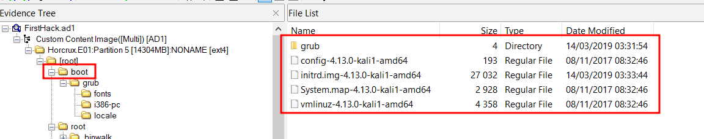

# Insider

## Info

- Category : Digital Forensics
- SHA1SUM : d820264d825fdaeb2146bf7b4c4e03684e700007
- Published : May 25, 2021
- Author : Champlain College
- Size : 83 MB
- Tags : Disk Linux FTK Kali

Uncompress the challenge (pass: cyberdefenders.org)

### Scenario

After Karen started working for 'TAAUSAI,' she began to do some illegal activities inside the company. 'TAAUSAI' hired you as a soc analyst to kick off an investigation on this case.

You acquired a disk image and found that Karen uses Linux OS on her machine. Analyze the disk image of Karen's computer and answer the provided questions.

### Tools

- FTK Imager

---

## Questions

### Q1 - What distribution of Linux is being used on this machine?



**Answer : kali**

### Q2 - What is the MD5 hash of the apache access.log?

`var > log > apache2`. Right click and export hash list for the `acces.log`

**Answer : d41d8cd98f00b204e9800998ecf8427e**

### Q3 - It is believed that a credential dumping tool was downloaded? What is the file name of the download?

Path : `root > Downloads`

**Answer : mimikatz_trunk.zip**

### Q4 - There was a super-secret file created. What is the absolute path?

In the `bash_history` we find : 

```shell
touch snky snky > /root/Desktop/SuperSecretFile.txt
cat snky snky > /root/Desktop/SuperSecretFile.txt 
```

**Answer : /root/Desktop/SuperSecretFile.txt** 

### Q5 - What program used didyouthinkwedmakeiteasy.jpg during execution?

Still in `bash_history`

```shell
binwalk didyouthinkwedmakeiteasy.jpg 
```

**Answer : binwalk**

### Q6 - What is the third goal from the checklist Karen created?

Path : `/root/Desktop/Checklist`

```shell
Check List:

- Gain Bob's Trust
- Learn how to hack
- Profit
```

**Answer : Profit**

### Q7 - How many times was apache run?

Path : `var > log > apache2`. Apache logs are empty

**Answer : 0**

### Q8 - It is believed this machine was used to attack another. What file proves this?

Path : `/root/irZLAohL.jpeg`

**Answer : irZLAohL.jpeg**

### Q9 - Within the Documents file path, it is believed that Karen was taunting a fellow computer expert through a bash script. Who was Karen taunting?

Path : `/root/Documents/myfirsthack/firstscript_fixed`

**Answer : Young**

### Q10 - A user su'd to root at 11:26 multiple times. Who was it?

We can find that information in `auth log` :

```shell
/var/log/auth.log | grep 11:26
```

**Answer : postgres**

### Q11 - Based on the bash history, what is the current working directory?

The last `cd` instruction In the `bash_history` was :

```shell
cd ../Documents/myfirsthack/
```

**Answer : /root/Documents/myfirsthack/**
