# Szechuan Sauce

## Info

- Category : Digital Forensics
- SHA1SUM : bce93945a6637ad0ff0fa25eee4cf0c5f9639474
- Published : Oct. 5, 2020, midnight
- Author : James Smith
- Size : 13 GB
- Tags : PCAP Memory Windows Disk

Unzip the challenge (pass: cyberdefenders.org), examine artifacts, and answer the provided questions.

### Challenge Files

- 20200918_0417_DESKTOP-SDN1RPT.E01: EnCase image file format (2 GB)
- 20200918_0417_DESKTOP-SDN1RPT.E02: EnCase image file format (2 GB)
- 20200918_0417_DESKTOP-SDN1RPT.E03: EnCase image file format (2 GB)
- 20200918_0417_DESKTOP-SDN1RPT.E04: EnCase image file format (2 GB)
- autorunsc-citadel-dc01.csv
- autoruns-desktop-sdn1rpt.csv
- case001.pcap (189 MB)
- citadeldc01.mem (2 GB)
- DESKTOP-SDN1RPT.mem
- E01-DC01
- 20200918_0347_CDrive.E01: EnCase image file format (2.4 GB)
- 20200918_0347_CDrive.E01.txt
- 20200918_0347_CDrive.E02 EnCase image file format (2.2 GB)

### Case Overview

Your bedroom door bursts open, shattering your pleasant dreams. Your mad scientist of a boss begins dragging you out of bed by the ankle. He simultaneously explains between belches that the FBI contacted him. They found his recently-developed Szechuan sauce recipe on the dark web. As you careen past the door frame you are able to grab your incident response “Go-Bag”. Inside is your trusty incident thumb drive and laptop.

### Note

Some files may be corrupted just like in the real world. If one tool does not work for you, find another one.

### Tools

- RegistryExplorer
- BrimSecurity
- WireShark
- FTK Imager
- Volatility3
- Event Log Explorer
- ClamAV
- Impacket
- Rifiuti2
- hashcat
- VirusTotal
- Hybrid-analysis

---

## Questions

### Q1 - What’s the Operating System version of the Server? (two words)

We can get the value in registry hive : `HKLM\Software\Microsoft\Windows NT\CurrentVersion` --> `Product Name`

#### From disk image

> In short the E01 File is an “Expert Witness File Format”. It is a compressed image that provides a legally admissible bit for bit copy of the target hard drive when captured with the proper tool.

You can mount manually those files or use a software like autopsy.

##### Mount manually

```shell
ewfmount 20200918_0347_CDrive.E01 mountpoint/E01 
ewfmount 20140608
```

```shell
fdisk -l mountpoint/E01/ewf1          
Disque mountpoint/E01/ewf1 : 11,25 GiB, 12079595520 octets, 23592960 secteurs
Unités : secteur de 1 × 512 = 512 octets
Taille de secteur (logique / physique) : 512 octets / 512 octets
taille d'E/S (minimale / optimale) : 512 octets / 512 octets
Type d'étiquette de disque : dos
Identifiant de disque : 0xb5d783b3

Périphérique                 Amorçage  Début      Fin Secteurs Taille Id Type
mountpoint/E01/ewf1p1 *          2048   718847   716800   350M  7 HPFS/NTFS/exFAT
mountpoint/E01/ewf1p2          718848 23590911 22872064  10,9G  7 HPFS/NTFS/exFAT
```

```shell
mount -t ntfs-3g -o loop=/dev/loop3,ro,show_sys_files,stream_interface=windows,offset=$((718848*512)) mountpoint/E01/ewf1 mountpoint/ewf1p2
```

For my case, I'll use autopsy. Go to `Windows\System32\config`. Choose SOFTWARE hive and browse to `\Microsoft\Windows NT\CurrentVersion` --> `Product Name`

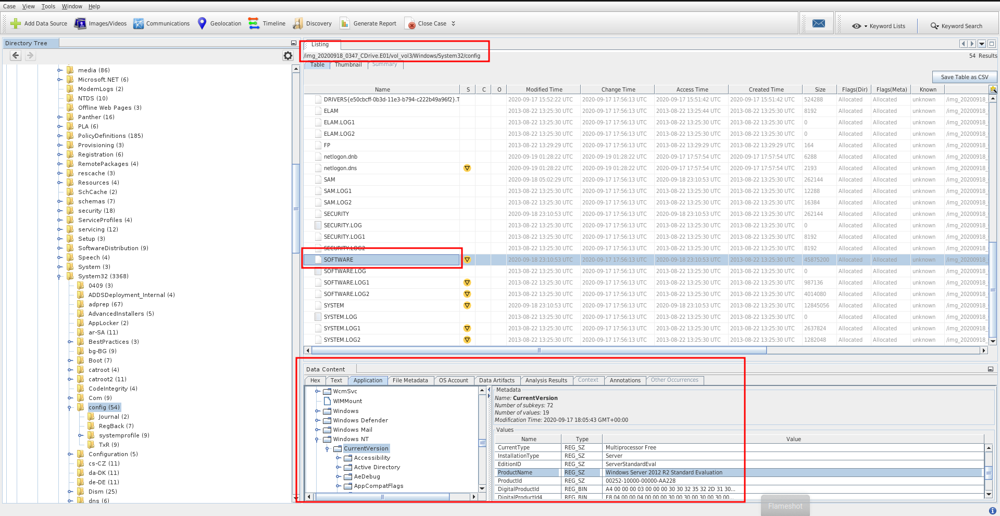

#### From memory capture

```shell
vol3d -f `wvol c15-SzechuanSauce/citadeldc01.mem` windows.registry.hivelist                                                               
Volatility 3 Framework 2.5.0    PDB scanning finished                        

Offset  FileFullPath    File output

0xc001f0c1e000          Disabled
0xc001f0c28000  \REGISTRY\MACHINE\SYSTEM        Disabled
0xc001f0c55000  \REGISTRY\MACHINE\HARDWARE      Disabled
0xc001f1166000  \Device\HarddiskVolume1\Boot\BCD        Disabled
0xc001f117a000  \SystemRoot\System32\Config\SOFTWARE    Disabled
0xc001f3c1a000  \SystemRoot\System32\Config\DEFAULT     Disabled
0xc001f76b8000  \SystemRoot\System32\Config\SECURITY    Disabled
0xc001f773b000  \SystemRoot\System32\Config\SAM Disabled
0xc001f7735000  \??\C:\Windows\ServiceProfiles\NetworkService\NTUSER.DAT        Disabled
0xc001f1200000  \SystemRoot\System32\Config\BBI Disabled
0xc001f129d000  \??\C:\Windows\ServiceProfiles\LocalService\NTUSER.DAT  Disabled
0xc001f3208000  \??\C:\Users\Administrator\ntuser.dat   Disabled
0xc001f3216000  \??\C:\Users\Administrator\AppData\Local\Microsoft\Windows\UsrClass.dat Disabled
0xc001f30e0000  \??\C:\Users\Administrator\ntuser.dat   Disabled
0xc001f326b000  \??\C:\Users\Administrator\AppData\Local\Microsoft\Windows\UsrClass.dat Disabled
0xc001f1f00000  \??\C:\Users\Administrator\ntuser.dat   Disabled
0xc001f1f2a000  \??\C:\Users\Administrator\AppData\Local\Microsoft\Windows\UsrClass.dat Disabled
0xc001f1e41000  \??\C:\Users\Administrator\ntuser.dat   Disabled
0xc001f1e94000  \??\C:\Users\Administrator\AppData\Local\Microsoft\Windows\UsrClass.dat Disabled
```

```shell
vol3d -f `wvol c15-SzechuanSauce/citadeldc01.mem` windows.registry.printkey.PrintKey --offset 0xc001f117a000 --key "Microsoft\Windows NT\CurrentVersion" | grep ProductNa
me
2020-09-17 18:05:43.000000      0xc001f117a000inREG_SZ  \SystemRoot\System32\Config\SOFTWARE\Microsoft\Windows NT\CurrentVersion        ProductName     "Windows Server 2012 R2 Standard Evaluation"   False
```

**Answer : 2012 R2**

### Q2 - What’s the Operating System of the Desktop? (four words separated by spaces)

Do the same as the precedent question

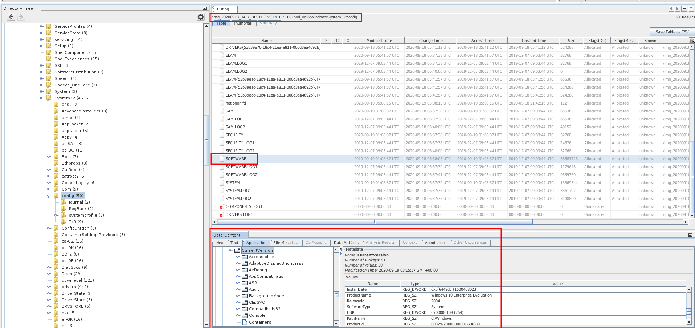

**Answer : Windows 10 Enterprise Evaluation**

### Q3 - What was the IP address assigned to the domain controller?

I extracted the DC SYSTEM Hive.

I used a plugin that i made for the [regipy](https://github.com/mkorman90/regipy) tool.

```shell
registry-plugins-run ./case/sauced/Export/DC/SYSTEM -p network_data -o DC-network.json
Loaded 38 plugins
INFO:regipy.registry:Found control sets: ['\\ControlSet001\\Services\\Tcpip\\Parameters\\Interfaces', '\\ControlSet002\\Services\\Tcpip\\Parameters\\Interfaces']
Finished: 1/38 plugins matched the hive type
```

```json
cat network-DC.json| jq .
{
  "network_data": {
    "\\ControlSet001\\Services\\Tcpip\\Parameters\\Interfaces": {
      "timestamp": "2020-09-17T17:57:35.520358+00:00",
      "interfaces": [
        {
          "interface_name": "{1f777394-0b42-11e3-80ad-806e6f6e6963}",
          "last_modified": "2020-09-17T17:57:35.520358+00:00",
          "dhcp_enabled": false,
          "ip_address": null,
          "subnet_mask": null,
          "default_gateway": null,
          "name_server": null,
          "domain": null
        },
        {
          "interface_name": "{791D93FB-6EDF-4C65-B1B9-F8E46CFFEA73}",
          "last_modified": "2020-09-17T17:57:16.942142+00:00",
          "dhcp_enabled": false,
          "ip_address": [
            "10.42.85.10"
          ],
          "subnet_mask": [
            "255.255.255.0"
          ],
          "default_gateway": [
            "10.42.85.100"
          ],
          "name_server": "127.0.0.1",
          "domain": 0
        },
        {
          "interface_name": "{C7568B63-C424-48B3-AB9B-6D1F004D5AFC}",
          "last_modified": "2013-08-22T14:49:27.748520+00:00",
          "dhcp_enabled": true,
          "dhcp_server": null,
          "dhcp_ip_address": null,
          "dhcp_subnet_mask": null,
          "dhcp_default_gateway": null,
          "dhcp_name_server": null,
          "dhcp_domain": null
        }
      ]
    },
    "\\ControlSet002\\Services\\Tcpip\\Parameters\\Interfaces": {
      "timestamp": "2020-09-17T17:57:35.520358+00:00",
      "interfaces": [
        {
          "interface_name": "{1f777394-0b42-11e3-80ad-806e6f6e6963}",
          "last_modified": "2020-09-17T17:57:35.520358+00:00",
          "dhcp_enabled": false,
          "ip_address": null,
          "subnet_mask": null,
          "default_gateway": null,
          "name_server": null,
          "domain": null
        },
        {
          "interface_name": "{791D93FB-6EDF-4C65-B1B9-F8E46CFFEA73}",
          "last_modified": "2020-09-17T17:57:16.942142+00:00",
          "dhcp_enabled": false,
          "ip_address": [
            "10.42.85.10"
          ],
          "subnet_mask": [
            "255.255.255.0"
          ],
          "default_gateway": [
            "10.42.85.100"
          ],
          "name_server": "127.0.0.1",
          "domain": 0
        },
        {
          "interface_name": "{C7568B63-C424-48B3-AB9B-6D1F004D5AFC}",
          "last_modified": "2013-08-22T14:49:27.748520+00:00",
          "dhcp_enabled": true,
          "dhcp_server": null,
          "dhcp_ip_address": null,
          "dhcp_subnet_mask": null,
          "dhcp_default_gateway": null,
          "dhcp_name_server": null,
          "dhcp_domain": null
        }
      ]
    }
  }
}
```

**Answer : 10.42.85.10**

### Q4 - What was the timezone of the Server?

```shell
registry-plugins-run ./case/sauced/Export/DC/SYSTEM -p timezone_data -o DC-timezone.json
Loaded 38 plugins
INFO:regipy.registry:Found control sets: ['\\ControlSet001\\Control\\TimeZoneInformation', '\\ControlSet002\\Control\\TimeZoneInformation']
```

```json
 cat DC-timezone.json | jq .                                                             
{
  "timezone_data": {
    "\\ControlSet001\\Control\\TimeZoneInformation": [
      {
        "name": "DaylightBias",
        "value": 4294967236,
        "value_type": "REG_DWORD",
        "is_corrupted": false
      },
      {
        "name": "DaylightName",
        "value": "@tzres.dll,-211",
        "value_type": "REG_SZ",
        "is_corrupted": false
      },
      {
        "name": "StandardStart",
        "value": "00000b00010002000000000000000000",
        "value_type": "REG_BINARY",
        "is_corrupted": false
      },
      {
        "name": "StandardBias",
        "value": 0,
        "value_type": "REG_DWORD",
        "is_corrupted": false
      },
      {
        "name": "StandardName",
        "value": "@tzres.dll,-212",
        "value_type": "REG_SZ",
        "is_corrupted": false
      },
      {
        "name": "Bias",
        "value": 480,
        "value_type": "REG_DWORD",
        "is_corrupted": false
      },
      {
        "name": "DaylightStart",
        "value": "00000300020002000000000000000000",
        "value_type": "REG_BINARY",
        "is_corrupted": false
      },
      {
        "name": "TimeZoneKeyName",
        "value": "Pacific Standard Time",
        "value_type": "REG_SZ",
        "is_corrupted": false
      },
      {
        "name": "DynamicDaylightTimeDisabled",
        "value": 0,
        "value_type": "REG_DWORD",
        "is_corrupted": false
      },
      {
        "name": "ActiveTimeBias",
        "value": 420,
        "value_type": "REG_DWORD",
        "is_corrupted": false
      }
    ],
    "\\ControlSet002\\Control\\TimeZoneInformation": [
      {
        "name": "DaylightBias",
        "value": 4294967236,
        "value_type": "REG_DWORD",
        "is_corrupted": false
      },
      {
        "name": "DaylightName",
        "value": "@tzres.dll,-211",
        "value_type": "REG_SZ",
        "is_corrupted": false
      },
      {
        "name": "StandardStart",
        "value": "00000b00010002000000000000000000",
        "value_type": "REG_BINARY",
        "is_corrupted": false
      },
      {
        "name": "StandardBias",
        "value": 0,
        "value_type": "REG_DWORD",
        "is_corrupted": false
      },
      {
        "name": "StandardName",
        "value": "@tzres.dll,-212",
        "value_type": "REG_SZ",
        "is_corrupted": false
      },
      {
        "name": "Bias",
        "value": 480,
        "value_type": "REG_DWORD",
        "is_corrupted": false
      },
      {
        "name": "DaylightStart",
        "value": "00000300020002000000000000000000",
        "value_type": "REG_BINARY",
        "is_corrupted": false
      },
      {
        "name": "TimeZoneKeyName",
        "value": "Pacific Standard Time",
        "value_type": "REG_SZ",
        "is_corrupted": false
      },
      {
        "name": "DynamicDaylightTimeDisabled",
        "value": 0,
        "value_type": "REG_DWORD",
        "is_corrupted": false
      },
      {
        "name": "ActiveTimeBias",
        "value": 420,
        "value_type": "REG_DWORD",
        "is_corrupted": false
      }
    ]
  }
}
```

The Pacific time zone corresponding to UTC−8 in winter and UTC−7 in summer (in the Northern Hemisphere), but that doesn't seem to be the right answer. So, we'll look elsewhere

In wireshark, looking for NTP requests we can see that the clock is unsynchronized.

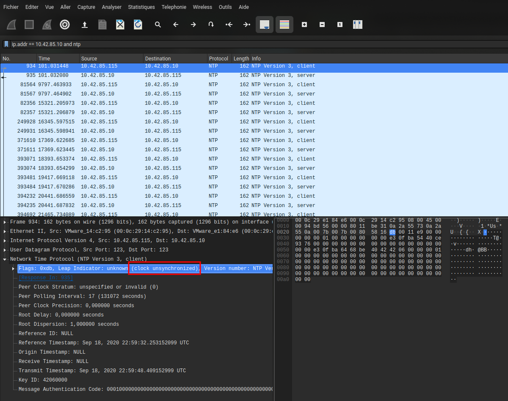

Let's go compare events logs and networks logs.

In the wirshark capture, we can see RDP request :

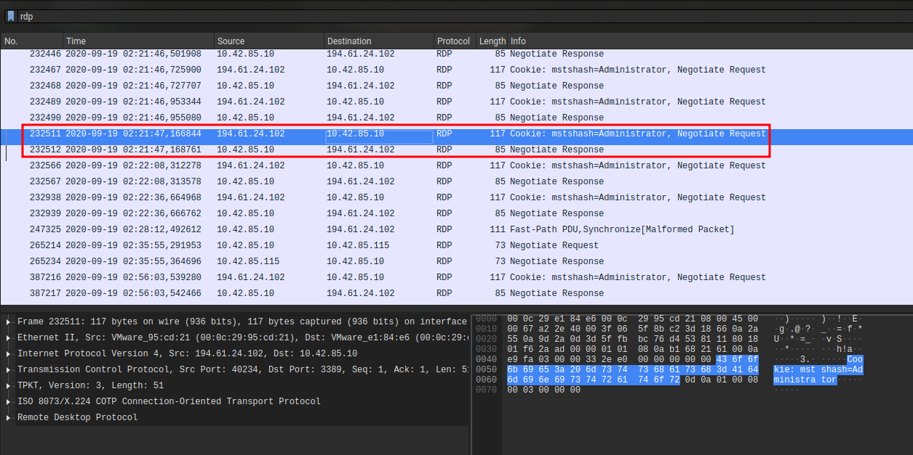

Let's find in logs for an EventID 4624 LogonType 10.

> Logon type 10: RemoteInteractive. A user logged on to this computer remotely using Terminal Services or Remote Desktop.
> 
> This logon type is similar to 2 (Interactive) but a user connects the computer from a remote machine via RDP (using Remote Desktop, Terminal Services or Remote Assistance).

Extract logs and convert to json :

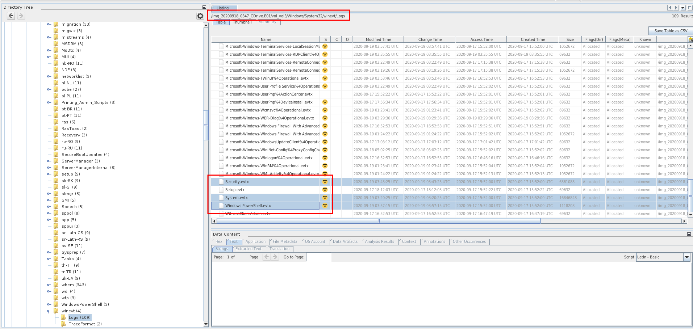

```shell
./evtx_dump -o json case/sauced/Export/DC/335448-Security.evtx > DC-security.json
```

The first RDP logon:

```json
Record 7495
{
  "Event": {
    "#attributes": {
      "xmlns": "http://schemas.microsoft.com/win/2004/08/events/event"
    },
    "EventData": {
      "AuthenticationPackageName": "Negotiate",
      "ImpersonationLevel": "%%1833",
      "IpAddress": "194.61.24.102",
      "IpPort": "0",
      "KeyLength": 0,
      "LmPackageName": "-",
      "LogonGuid": "71334FAB-9DC8-3B83-5CF0-7392D7EF15F2",
      "LogonProcessName": "User32 ",
      "LogonType": 10,
      "ProcessId": "0x4c4",
      "ProcessName": "C:\\Windows\\System32\\winlogon.exe",
      "SubjectDomainName": "C137",
      "SubjectLogonId": "0x3e7",
      "SubjectUserName": "CITADEL-DC01$",
      "SubjectUserSid": "S-1-5-18",
      "TargetDomainName": "C137",
      "TargetLogonId": "0x510986",
      "TargetUserName": "Administrator",
      "TargetUserSid": "S-1-5-21-2232410529-1445159330-2725690660-500",
      "TransmittedServices": "-",
      "WorkstationName": "CITADEL-DC01"
    },
    "System": {
      "Channel": "Security",
      "Computer": "CITADEL-DC01.C137.local",
      "Correlation": null,
      "EventID": 4624,
      "EventRecordID": 7495,
      "Execution": {
        "#attributes": {
          "ProcessID": 460,
          "ThreadID": 1016
        }
      },
      "Keywords": "0x8020000000000000",
      "Level": 0,
      "Opcode": 0,
      "Provider": {
        "#attributes": {
          "Guid": "54849625-5478-4994-A5BA-3E3B0328C30D",
          "Name": "Microsoft-Windows-Security-Auditing"
        }
      },
      "Security": null,
      "Task": 12544,
      "TimeCreated": {
        "#attributes": {
          "SystemTime": "2020-09-19T03:21:48.891087Z"
        }
      },
      "Version": 1
    }
  }
}
```

The difference between the two log sources is one hour. The DC is for UTC-6 timezone.

**Answer : UTC-6**

### Q5 - What was the initial entry vector (how did they get in)?. Provide protocol name.

If we take the RDP authentication logs from the question before we can believe that it is legitimate. However, if we look at the events that follow in the logical sequence of an authentication (Record 7497) we see that the machine which initiated the connection is called "kali" which is very suspicious. The protocol used is therefore RDP

Event Logs for Normal Authentication :
- Record 7495 : 4624 – An account was successfully logged on. (On target)
- Record 7496 : 4672 – Special privileges assigned to new logon. (On target)
- Record 7497 : 4776 – The computer attempted to validate the credentials for an account. (only on DC)

```json
Record 7497
{
  "Event": {
    "#attributes": {
      "xmlns": "http://schemas.microsoft.com/win/2004/08/events/event"
    },
    "EventData": {
      "PackageName": "MICROSOFT_AUTHENTICATION_PACKAGE_V1_0",
      "Status": "0x0",
      "TargetUserName": "Administrator",
      "Workstation": "kali"
    },
    "System": {
      "Channel": "Security",
      "Computer": "CITADEL-DC01.C137.local",
      "Correlation": null,
      "EventID": 4776,
      "EventRecordID": 7497,
      "Execution": {
        "#attributes": {
          "ProcessID": 460,
          "ThreadID": 1016
        }
      },
      "Keywords": "0x8020000000000000",
      "Level": 0,
      "Opcode": 0,
      "Provider": {
        "#attributes": {
          "Guid": "54849625-5478-4994-A5BA-3E3B0328C30D",
          "Name": "Microsoft-Windows-Security-Auditing"
        }
      },
      "Security": null,
      "Task": 14336,
      "TimeCreated": {
        "#attributes": {
          "SystemTime": "2020-09-19T03:22:07.924919Z"
        }
      },
      "Version": 0
    }
  }
}
```

**Answer : RDP (Remote Desktop Protocol)**

### Q6 - What was the malicious process used by the malware? (one word)

To find the malicious process we will search in DC's memory capture

```shell
vol3d -f `wvol c15-SzechuanSauce/citadeldc01.mem` windows.pstree.PsTree                               
Volatility 3 Framework 2.5.0    PDB scanning finished                        

PID     PPID    ImageFileName   Offset(V)       Threads Handles SessionId       Wow64   CreateTime      ExitTime

4       0       System  0xe0005f273040  98      -       N/A     False   2020-09-19 01:22:38.000000      N/A
* 204   4       smss.exe        0xe00060354900  2       -       N/A     False   2020-09-19 01:22:38.000000      N/A
324     316     csrss.exe       0xe000602c2080  8       -       0       False   2020-09-19 01:22:39.000000      N/A
404     316     wininit.exe     0xe000602cc900  1       -       0       False   2020-09-19 01:22:40.000000      N/A
* 460   404     lsass.exe       0xe00060c0e080  31      -       0       False   2020-09-19 01:22:40.000000      N/A
* 452   404     services.exe    0xe00060c11080  5       -       0       False   2020-09-19 01:22:40.000000      N/A
** 640  452     svchost.exe     0xe00060c84900  8       -       0       False   2020-09-19 01:22:40.000000      N/A
*** 2056        640     WmiPrvSE.exe    0xe000629de900  11      -       0       False   2020-09-19 01:23:21.000000      N/A
*** 2764        640     WmiPrvSE.exe    0xe00062c0a900  6       -       0       False   2020-09-19 04:37:42.000000      N/A
** 1292 452     Microsoft.Acti  0xe00060f73900  9       -       0       False   2020-09-19 01:22:57.000000      N/A
** 3724 452     spoolsv.exe     0xe000631cb900  13      -       0       False   2020-09-19 03:29:40.000000      N/A
** 1556 452     VGAuthService.  0xe000614aa200  2       -       0       False   2020-09-19 01:22:57.000000      N/A
** 796  452     vds.exe 0xe000629b3080  11      -       0       False   2020-09-19 01:23:20.000000      N/A
** 668  452     svchost.exe     0xe00060e09900  16      -       0       False   2020-09-19 01:22:41.000000      N/A
** 2460 452     msdtc.exe       0xe00062a2a900  9       -       0       False   2020-09-19 01:23:21.000000      N/A
** 800  452     svchost.exe     0xe00060ca3900  12      -       0       False   2020-09-19 01:22:40.000000      N/A
** 928  452     svchost.exe     0xe00060d5d500  16      -       0       False   2020-09-19 01:22:41.000000      N/A
** 1956 452     svchost.exe     0xe0006291b7c0  30      -       0       False   2020-09-19 01:23:20.000000      N/A
** 2216 452     dllhost.exe     0xe00062a26900  10      -       0       False   2020-09-19 01:23:21.000000      N/A
** 684  452     svchost.exe     0xe00060c9a700  6       -       0       False   2020-09-19 01:22:40.000000      N/A
** 1332 452     dfsrs.exe       0xe00060fe1900  16      -       0       False   2020-09-19 01:22:57.000000      N/A
** 1600 452     vmtoolsd.exe    0xe00061a30900  9       -       0       False   2020-09-19 01:22:57.000000      N/A
** 848  452     svchost.exe     0xe00060d1e080  39      -       0       False   2020-09-19 01:22:41.000000      N/A
*** 3056        848     WMIADAP.exe     0xe0006313f900  5       -       0       False   2020-09-19 04:37:42.000000      N/A
*** 3796        848     taskhostex.exe  0xe00062f04900  7       -       1       False   2020-09-19 04:36:03.000000      N/A
** 1236 452     svchost.exe     0xe000629926c0  8       -       0       False   2020-09-19 01:23:21.000000      N/A
** 1368 452     dns.exe 0xe00060ff3080  16      -       0       False   2020-09-19 01:22:57.000000      N/A
** 1000 452     svchost.exe     0xe00060da2080  18      -       0       False   2020-09-19 01:22:41.000000      N/A
** 1644 452     wlms.exe        0xe00061a9a800  2       -       0       False   2020-09-19 01:22:57.000000      N/A
** 1392 452     ismserv.exe     0xe00060ff7900  6       -       0       False   2020-09-19 01:22:57.000000      N/A
** 1660 452     dfssvc.exe      0xe00061a9b2c0  11      -       0       False   2020-09-19 01:22:57.000000      N/A
412     396     csrss.exe       0xe000602c1900  10      -       1       False   2020-09-19 01:22:40.000000      N/A
492     396     winlogon.exe    0xe00060c2a080  4       -       1       False   2020-09-19 01:22:40.000000      N/A
* 808   492     dwm.exe 0xe00060d09680  7       -       1       False   2020-09-19 01:22:40.000000      N/A
3644    2244    coreupdater.ex  0xe00062fe7700  0       -       2       False   2020-09-19 03:56:37.000000      2020-09-19 03:56:52.000000 
3472    3960    explorer.exe    0xe00063171900  39      -       1       False   2020-09-19 04:36:03.000000      N/A
* 2608  3472    vmtoolsd.exe    0xe00062ede1c0  8       -       1       False   2020-09-19 04:36:14.000000      N/A
* 2840  3472    FTK Imager.exe  0xe00063021900  9       -       1       False   2020-09-19 04:37:04.000000      N/A
* 3260  3472    vm3dservice.ex  0xe00063299280  1       -       1       False   2020-09-19 04:36:14.000000      N/A
400     1904    ServerManager.  0xe00060ce2080  10      -       1       False   2020-09-19 04:36:03.000000      N/A
```

We have the suspicious process named “coreupdater.ex”. He does not have a parental process, at least it is not known or hidden. If we compare to the rest of the system it is the only one with an execution start time different from the other processes. We eliminate processes launched after 4:36.

```
3644    2244    coreupdater.ex  0xe00062fe7700  0       -       2       False   2020-09-19 03:56:37.000000      2020-09-19 03:56:52.000000 
```

If we want to make sure that is the real malicious process, we can try to extract him.

From memory (fail) :

```shell
vol3d -f `wvol c15-SzechuanSauce/citadeldc01.mem` -o `wvol ./` windows.pslist.PsList --pid 3644 --dump
Volatility 3 Framework 2.5.0    PDB scanning finished                        

PID     PPID    ImageFileName   Offset(V)       Threads Handles SessionId       Wow64   CreateTime      ExitTime        File output

3644    2244    coreupdater.ex  0xe00062fe7700  0       -       2       False   2020-09-19 03:56:37.000000      2020-09-19 03:56:52.000000      Error outputting file
```

From disk (success) :

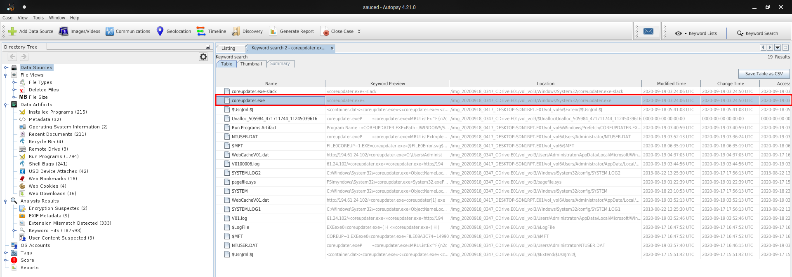

We put him on VT :

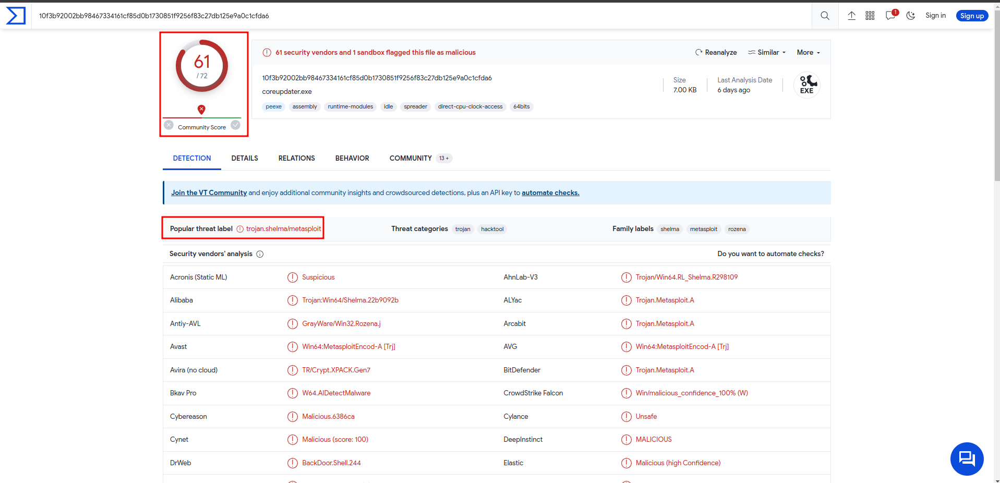

Exe detect as malicious. (Metasploit trojan)

**Answer : coreupdater**

### Q7 - Which process did malware migrate to after the initial compromise? (one word)

Do a malfind on the memory :

```shell
vol3d -f `wvol c15-SzechuanSauce/citadeldc01.mem` windows.malfind.Malfind                
Volatility 3 Framework 2.5.0    PDB scanning finished                        

PID     Process Start VPN       End VPN Tag     Protection      CommitCharge    PrivateMemory   File output     Hexdump Disasm
1236    svchost.exe     0x1b10ee0000    0x1b10ee0fff    VadS    PAGE_EXECUTE_READWRITE  1       1       Disabled
00 00 00 00 00 00 00 00 ........
00 00 00 00 00 00 00 00 ........
00 00 00 00 00 00 00 00 ........
00 00 00 00 00 00 00 00 ........
00 00 ee 10 1b 00 00 00 ........
00 00 00 00 00 00 00 00 ........
00 00 00 00 00 00 00 00 ........
00 00 00 00 00 00 00 00 ........
0x1b10ee0000:   add     byte ptr [rax], al
0x1b10ee0002:   add     byte ptr [rax], al
0x1b10ee0004:   add     byte ptr [rax], al
0x1b10ee0006:   add     byte ptr [rax], al
0x1b10ee0008:   add     byte ptr [rax], al
0x1b10ee000a:   add     byte ptr [rax], al
0x1b10ee000c:   add     byte ptr [rax], al
0x1b10ee000e:   add     byte ptr [rax], al
0x1b10ee0010:   add     byte ptr [rax], al
0x1b10ee0012:   add     byte ptr [rax], al
0x1b10ee0014:   add     byte ptr [rax], al
0x1b10ee0016:   add     byte ptr [rax], al
0x1b10ee0018:   add     byte ptr [rax], al
0x1b10ee001a:   add     byte ptr [rax], al
0x1b10ee001c:   add     byte ptr [rax], al
0x1b10ee001e:   add     byte ptr [rax], al
0x1b10ee0020:   add     byte ptr [rax], al
0x1b10ee0022:   out     dx, al
0x1b10ee0023:   adc     byte ptr [rbx], bl
0x1b10ee0025:   add     byte ptr [rax], al
0x1b10ee0027:   add     byte ptr [rax], al
0x1b10ee0029:   add     byte ptr [rax], al
0x1b10ee002b:   add     byte ptr [rax], al
0x1b10ee002d:   add     byte ptr [rax], al
0x1b10ee002f:   add     byte ptr [rax], al
0x1b10ee0031:   add     byte ptr [rax], al
0x1b10ee0033:   add     byte ptr [rax], al
0x1b10ee0035:   add     byte ptr [rax], al
0x1b10ee0037:   add     byte ptr [rax], al
0x1b10ee0039:   add     byte ptr [rax], al
0x1b10ee003b:   add     byte ptr [rax], al
0x1b10ee003d:   add     byte ptr [rax], al
3724    spoolsv.exe     0x4afbf20000    0x4afbf51fff    VadS    PAGE_EXECUTE_READWRITE  50      1       Disabled
fc 48 89 ce 48 81 ec 00 .H..H...
20 00 00 48 83 e4 f0 e8 ...H....
cc 00 00 00 41 51 41 50 ....AQAP
52 51 56 48 31 d2 65 48 RQVH1.eH
8b 52 60 48 8b 52 18 48 .R`H.R.H
8b 52 20 48 8b 72 50 48 .R.H.rPH
0f b7 4a 4a 4d 31 c9 48 ..JJM1.H
31 c0 ac 3c 61 7c 02 2c 1..<a|.,
0x4afbf20000:   cld
0x4afbf20001:   mov     rsi, rcx
0x4afbf20004:   sub     rsp, 0x2000
0x4afbf2000b:   and     rsp, 0xfffffffffffffff0
0x4afbf2000f:   call    0x4afbf200e0
0x4afbf20014:   push    r9
0x4afbf20016:   push    r8
0x4afbf20018:   push    rdx
0x4afbf20019:   push    rcx
0x4afbf2001a:   push    rsi
0x4afbf2001b:   xor     rdx, rdx
0x4afbf2001e:   mov     rdx, qword ptr gs:[rdx + 0x60]
0x4afbf20023:   mov     rdx, qword ptr [rdx + 0x18]
0x4afbf20027:   mov     rdx, qword ptr [rdx + 0x20]
0x4afbf2002b:   mov     rsi, qword ptr [rdx + 0x50]
0x4afbf2002f:   movzx   rcx, word ptr [rdx + 0x4a]
0x4afbf20034:   xor     r9, r9
0x4afbf20037:   xor     rax, rax
0x4afbf2003a:   lodsb   al, byte ptr [rsi]
0x4afbf2003b:   cmp     al, 0x61
0x4afbf2003d:   jl      0x4afbf20041
3724    spoolsv.exe     0x4afc1f0000    0x4afc25afff    VadS    PAGE_EXECUTE_READWRITE  107     1       Disabled
4d 5a 90 00 03 00 00 00 MZ......
04 00 00 00 ff ff 00 00 ........
b8 00 00 00 00 00 00 00 ........
40 00 00 00 00 00 00 00 @.......
00 00 00 00 00 00 00 00 ........
00 00 00 00 00 00 00 00 ........
00 00 00 00 00 00 00 00 ........
00 00 00 00 00 01 00 00 ........
0x4afc1f0000:   pop     r10
0x4afc1f0002:   nop
0x4afc1f0003:   add     byte ptr [rbx], al
0x4afc1f0005:   add     byte ptr [rax], al
0x4afc1f0007:   add     byte ptr [rax + rax], al
0x4afc1f000a:   add     byte ptr [rax], al
3724    spoolsv.exe     0x4afc070000    0x4afc0a8fff    VadS    PAGE_EXECUTE_READWRITE  57      1       Disabled
4d 5a 41 52 55 48 89 e5 MZARUH..
48 83 ec 20 48 83 e4 f0 H...H...
e8 00 00 00 00 5b 48 81 .....[H.
c3 b7 57 00 00 ff d3 48 ..W....H
81 c3 34 b6 02 00 48 89 ..4...H.
3b 49 89 d8 6a 04 5a ff ;I..j.Z.
d0 00 00 00 00 00 00 00 ........
00 00 00 00 f0 00 00 00 ........
0x4afc070000:   pop     r10
0x4afc070002:   push    r10
0x4afc070004:   push    rbp
0x4afc070005:   mov     rbp, rsp
0x4afc070008:   sub     rsp, 0x20
0x4afc07000c:   and     rsp, 0xfffffffffffffff0
0x4afc070010:   call    0x4afc070015
0x4afc070015:   pop     rbx
0x4afc070016:   add     rbx, 0x57b7
0x4afc07001d:   call    rbx
0x4afc07001f:   add     rbx, 0x2b634
0x4afc070026:   mov     qword ptr [rbx], rdi
0x4afc070029:   mov     r8, rbx
0x4afc07002c:   push    4
0x4afc07002e:   pop     rdx
0x4afc07002f:   call    rax
0x4afc070031:   add     byte ptr [rax], al
0x4afc070033:   add     byte ptr [rax], al
0x4afc070035:   add     byte ptr [rax], al
0x4afc070037:   add     byte ptr [rax], al
0x4afc070039:   add     byte ptr [rax], al
0x4afc07003b:   add     al, dh
0x4afc07003d:   add     byte ptr [rax], al
3724    spoolsv.exe     0x4afc260000    0x4afc283fff    VadS    PAGE_EXECUTE_READWRITE  36      1       Disabled
4d 5a 90 00 03 00 00 00 MZ......
04 00 00 00 ff ff 00 00 ........
b8 00 00 00 00 00 00 00 ........
40 00 00 00 00 00 00 00 @.......
00 00 00 00 00 00 00 00 ........
00 00 00 00 00 00 00 00 ........
00 00 00 00 00 00 00 00 ........
00 00 00 00 e0 00 00 00 ........
0x4afc260000:   pop     r10
0x4afc260002:   nop
0x4afc260003:   add     byte ptr [rbx], al
0x4afc260005:   add     byte ptr [rax], al
0x4afc260007:   add     byte ptr [rax + rax], al
0x4afc26000a:   add     byte ptr [rax], al
3472    explorer.exe    0x5770000       0x5770fff       VadS    PAGE_EXECUTE_READWRITE  1       1       Disabled
00 00 00 00 00 00 00 00 ........
00 00 00 00 00 00 00 00 ........
00 00 00 00 00 00 00 00 ........
00 00 00 00 00 00 00 00 ........
00 00 00 00 00 00 00 00 ........
00 00 00 00 00 00 00 00 ........
00 00 00 00 00 00 00 00 ........
00 00 00 00 00 00 00 00 ........
0x5770000:      add     byte ptr [rax], al
0x5770002:      add     byte ptr [rax], al
0x5770004:      add     byte ptr [rax], al
0x5770006:      add     byte ptr [rax], al
0x5770008:      add     byte ptr [rax], al
0x577000a:      add     byte ptr [rax], al
0x577000c:      add     byte ptr [rax], al
0x577000e:      add     byte ptr [rax], al
0x5770010:      add     byte ptr [rax], al
0x5770012:      add     byte ptr [rax], al
0x5770014:      add     byte ptr [rax], al
0x5770016:      add     byte ptr [rax], al
0x5770018:      add     byte ptr [rax], al
0x577001a:      add     byte ptr [rax], al
0x577001c:      add     byte ptr [rax], al
0x577001e:      add     byte ptr [rax], al
0x5770020:      add     byte ptr [rax], al
0x5770022:      add     byte ptr [rax], al
0x5770024:      add     byte ptr [rax], al
0x5770026:      add     byte ptr [rax], al
0x5770028:      add     byte ptr [rax], al
0x577002a:      add     byte ptr [rax], al
0x577002c:      add     byte ptr [rax], al
0x577002e:      add     byte ptr [rax], al
0x5770030:      add     byte ptr [rax], al
0x5770032:      add     byte ptr [rax], al
0x5770034:      add     byte ptr [rax], al
0x5770036:      add     byte ptr [rax], al
0x5770038:      add     byte ptr [rax], al
0x577003a:      add     byte ptr [rax], al
0x577003c:      add     byte ptr [rax], al
0x577003e:      add     byte ptr [rax], al
```

I cut the output.

In my opinion, only 2 processes could have been compromised. `svchost.exe` or `spoolsv.exe`. We will dump and analyse them. 

```shell
vol3d -f `wvol c15-SzechuanSauce/citadeldc01.mem` -o `wvol ./` windows.malfind.Malfind --pid 1236 --dump
Volatility 3 Framework 2.5.0    PDB scanning finished                        

PID     Process Start VPN       End VPN Tag     Protection      CommitCharge    PrivateMemory   File output     Hexdump Disasm

1236    svchost.exe     0x1b10ee0000    0x1b10ee0fff    VadS    PAGE_EXECUTE_READWRITE  1       1       pid.1236.vad.0x1b10ee0000-0x1b10ee0fff.dmp
```

```shell
vol3d -f `wvol c15-SzechuanSauce/citadeldc01.mem` -o `wvol ./` windows.malfind.Malfind --pid 3724 --dump
Volatility 3 Framework 2.5.0    PDB scanning finished                        

PID     Process Start VPN       End VPN Tag     Protection      CommitCharge    PrivateMemory   File output     Hexdump Disasm

3724    spoolsv.exe     0x4afbf20000    0x4afbf51fff    VadS    PAGE_EXECUTE_READWRITE  50      1       pid.3724.vad.0x4afbf20000-0x4afbf51fff.dmp
[...]
```

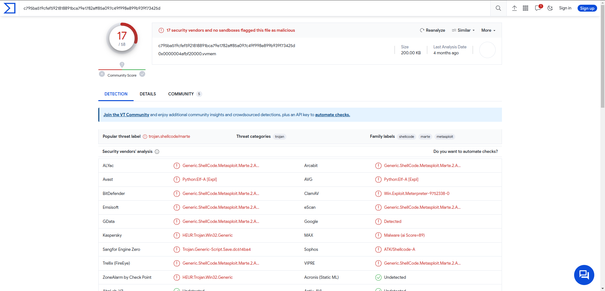

**Answer : spoolsv**

### Q8 - Identify the IP Address that delivered the payload.

Go look into the PCAP and specifically in the object.

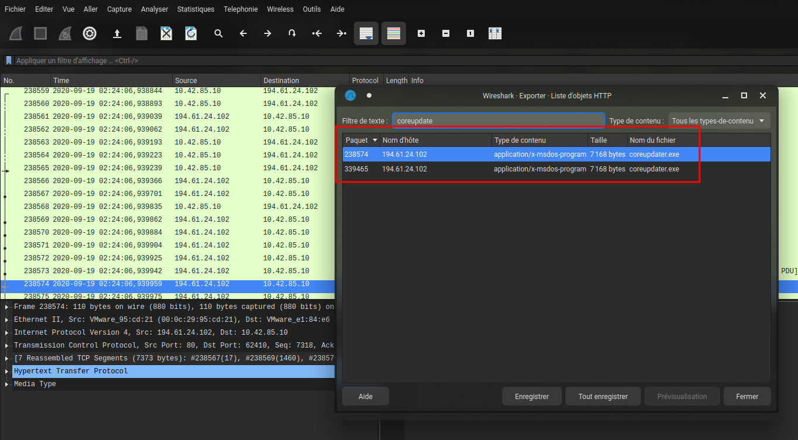

**Answer : 194.61.24.102**

### Q9 - What IP Address was the malware calling to?

We know that the malicious process is `coreupdater.exe`. Let's find the connections made with this one.

```shell
 vol3d -f `wvol c15-SzechuanSauce/citadeldc01.mem` windows.netstat.NetStat                             

Volatility 3 Framework 2.5.0    PDB scanning finished                        

Offset  Proto   LocalAddr       LocalPort       ForeignAddr     ForeignPort     State   PID     Owner   Created

0xe00063266d10  TCPv6   fe80::2dcf:e660:be73:d220       62777   fe80::2dcf:e660:be73:d220       49155   CLOSED  460     lsass.exe       -
0xe00062a31270  TCPv6   fe80::2dcf:e660:be73:d220       49182   fe80::2dcf:e660:be73:d220       389     ESTABLISHED     1332    dfsrs.exe       N/A
0xe0006103c4f0  TCPv6   fe80::2dcf:e660:be73:d220       49174   fe80::2dcf:e660:be73:d220       49155   ESTABLISHED     1660    dfssvc.exe      N/A
0xe000610d0640  TCPv6   ::1     49161   ::1     389     ESTABLISHED     1392    ismserv.exe     N/A
0xe000631c7590  TCPv4   10.42.85.10     62613   203.78.103.109  443     ESTABLISHED     3644    coreupdater.ex  N/A
0xe0006102d010  TCPv6   ::1     49160   ::1     389     ESTABLISHED     1392    ismserv.exe     N/A

Volatility was unable to read a requested page:
Page error 0x0 in layer layer_name (Page Fault at entry 0x0 in table page directory)

        * Memory smear during acquisition (try re-acquiring if possible)
        * An intentionally invalid page lookup (operating system protection)
        * A bug in the plugin/volatility3 (re-run with -vvv and file a bug)

No further results will be produced
```

**Answer : 203.78.103.109**

### Q10 - Where did the malware reside on the disk?


**Answer : C:\Windows\System32\coreupdater.exe**

### Q11 - What's the name of the attack tool you think this malware belongs to? (one word)

this question was answered above


**Answer : Metasploit**

### Q12 - One of the involved malicious IP's is based in Thailand. What was the IP?

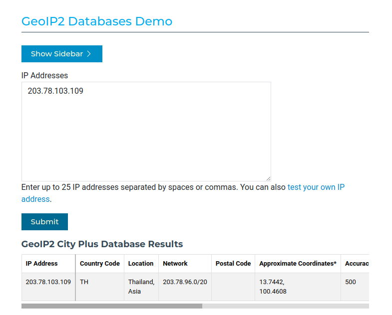

**Answer : 203.78.103.109**

### Q13 - Another malicious IP once resolved to klient-293.xyz . What is this IP?

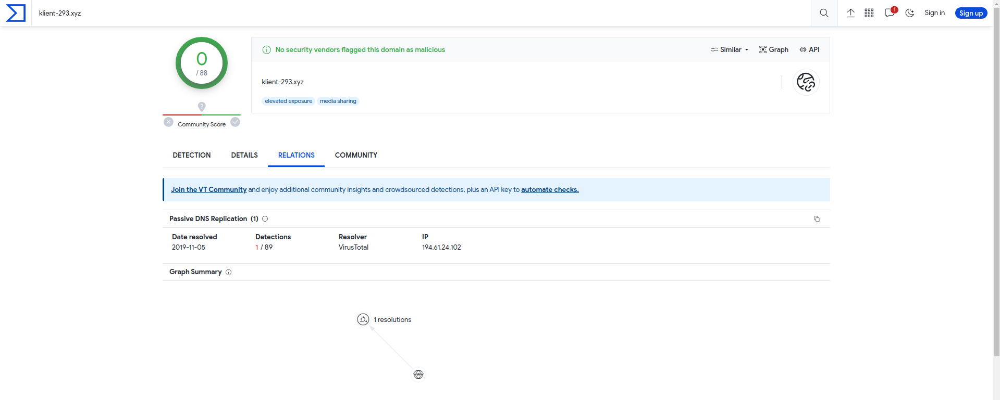

In resume :
- IP of the deliver : 194.61.24.102
- IP of the C2 : 203.78.103.109

**Answer : 194.61.24.102**

### Q14 - The attacker performed some lateral movements and accessed another system in the environment via RDP. What is the hostname of that system?

A lateral movement is carried out from an IS machine. We will therefore look for the RDP requests initiated by the DC (10.42.85.10).

`Filter : rdp and ip.src == 10.42.85.10`

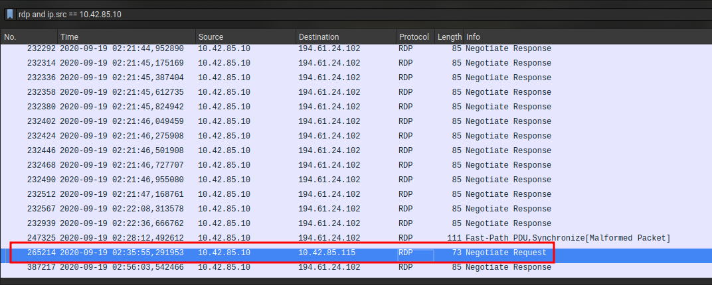

Now we got the IP of the target (10.42.85.115) we need to find her name.

> LLMNR, which stands for Link-Local Multicast Name Resolution, is a name resolution protocol used in local networks to resolve machine names to IP addresses. It is primarily used in Windows environments, although it may also be supported by other operating systems.

`Filter : llmnr and ip.src == 10.42.85.115`

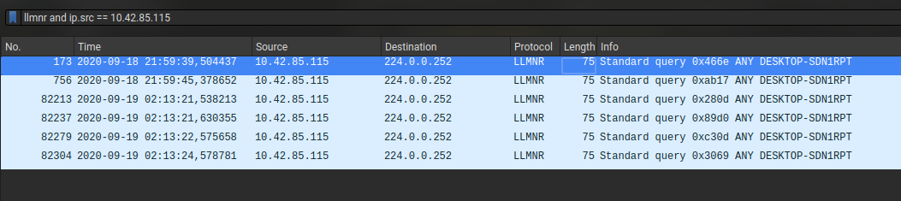

**Answer : DESKTOP-SDN1RPT**

### Q15 - Other than the administrator, which user has logged into the Desktop machine? (two words)

In the disk of this machine, we can look at the users :

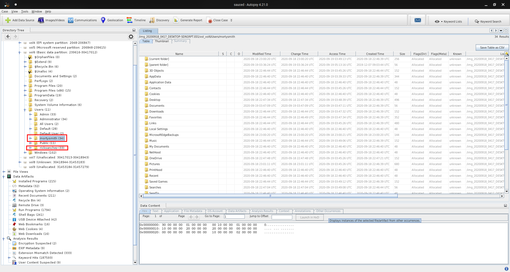

**Answer : rick sanchez**

### Q16 - What was the password for "jerrysmith" account?

Extract `ntds.dit` file from `C:\Windows\NTDS` and the SYSTEM hive from `C:\Windows\System32\config`

Use `secretdump.py` :

```shell
secretsdump.py -ntds case/sauced/Export/DC/ntds.dit -system case/sauced/Export/DC/SYSTEM LOCAL -outputfile hashes.txt
Impacket v0.9.24 - Copyright 2021 SecureAuth Corporation

[*] Target system bootKey: 0xdfa37c24984935de32e2063e02918c28
[*] Dumping Domain Credentials (domain\uid:rid:lmhash:nthash)
[*] Searching for pekList, be patient
[*] PEK # 0 found and decrypted: 6e884ac48cd2aa3a8d5f50c64d4bc38a
[*] Reading and decrypting hashes from case/sauced/Export/DC/ntds.dit 
Administrator:500:aad3b435b51404eeaad3b435b51404ee:10e63d3f2c9924bae49241cff847e405:::
Guest:501:aad3b435b51404eeaad3b435b51404ee:31d6cfe0d16ae931b73c59d7e0c089c0:::
CITADEL-DC01$:1001:aad3b435b51404eeaad3b435b51404ee:33c082748b7d35ec846a513b7be92d94:::
krbtgt:502:aad3b435b51404eeaad3b435b51404ee:25c9610b742a5bca9aa3801c08b8ca4e:::
C137.local\jerrysmith:1104:aad3b435b51404eeaad3b435b51404ee:bc51f858ccacc9db408c0ba511d5d639:::
C137.local\summersmith:1105:aad3b435b51404eeaad3b435b51404ee:26b2cc706093c4fa46e0519ec5feaeaf:::
C137.local\ricksanchez:1106:aad3b435b51404eeaad3b435b51404ee:746447f27820a9d863eea94d176cc135:::
C137.local\mortysmith:1108:aad3b435b51404eeaad3b435b51404ee:dc8b282b8f4e1dd3c5f95fd491ff6d8d:::
C137.local\bethsmith:1109:aad3b435b51404eeaad3b435b51404ee:b9cc9177094af2e17b413a0cbf63fac2:::
C137.local\birdman:1118:aad3b435b51404eeaad3b435b51404ee:944055b77ebe7d6fd80f24b5fce634fb:::
DESKTOP-SDN1RPT$:1602:aad3b435b51404eeaad3b435b51404ee:fa6ecdc900cbeeb623cfc92297e5b653:::
[*] Kerberos keys from case/sauced/Export/DC/ntds.dit 
CITADEL-DC01$:aes256-cts-hmac-sha1-96:3635b6b22a960673e327ca4c378e162befa74ee56e46b3841b84cabecfc062e8
CITADEL-DC01$:aes128-cts-hmac-sha1-96:9324dad1f82699bf65cdbfd5a4572067
CITADEL-DC01$:des-cbc-md5:94abfd29f1929d19
krbtgt:aes256-cts-hmac-sha1-96:141aca9186cc33caa6ef3db5cf3a53b783bd29e7431a153c89f8b1d4562de7f1
krbtgt:aes128-cts-hmac-sha1-96:d695009f7f7b6eb48a6b1b749493f199
krbtgt:des-cbc-md5:b025018c62ec023b
C137.local\jerrysmith:aes256-cts-hmac-sha1-96:87eb9c5715de1eb078cc6691871672019356976f093348c03b0ca21a75fc0e9f
C137.local\jerrysmith:aes128-cts-hmac-sha1-96:ea468a0f250c15fea4e8f4c74d20c56e
C137.local\jerrysmith:des-cbc-md5:7c40d03464e5e9a8
C137.local\summersmith:aes256-cts-hmac-sha1-96:38060a9e953e8dde6e991db5de72e566c8a652c195b0e88d9c81e26d05ee1ce5
C137.local\summersmith:aes128-cts-hmac-sha1-96:8851e24f50c80026e2e1578a2a3d3802
C137.local\summersmith:des-cbc-md5:3bd09e3b73bfb0f4
C137.local\ricksanchez:aes256-cts-hmac-sha1-96:08bc14d8f69e1ceadd0079303cd1bc434ed61d6a4895f71073662ff24eb8e4dd
C137.local\ricksanchez:aes128-cts-hmac-sha1-96:0c428543d20db44c45cbf6948b4cf5d4
C137.local\ricksanchez:des-cbc-md5:cdf891a75889f107
C137.local\mortysmith:aes256-cts-hmac-sha1-96:ee5442baa6535d2580ac694ac6c0cbe3a65f137ba3ace39a18cba58a160ce73c
C137.local\mortysmith:aes128-cts-hmac-sha1-96:697ece25fd3cffbfa24d82ab9789596c
C137.local\mortysmith:des-cbc-md5:3280f79b131aea4c
C137.local\bethsmith:aes256-cts-hmac-sha1-96:1e98c29b4ba43d21d200bd1802ff5109c0549621931e2f3af0c0809099405b88
C137.local\bethsmith:aes128-cts-hmac-sha1-96:ea3285637fe5bb216bcd5cd0cfbc6663
C137.local\bethsmith:des-cbc-md5:151f891ff4cb6b4f
C137.local\birdman:aes256-cts-hmac-sha1-96:f20039a71fad3a9a0a374c09e55f1d1bed1600c2329fee84aada8a502d903023
C137.local\birdman:aes128-cts-hmac-sha1-96:6507f6ac1b4ec9c23e65d1528ec92ec1
C137.local\birdman:des-cbc-md5:2f4068527aeafb85
DESKTOP-SDN1RPT$:aes256-cts-hmac-sha1-96:424f9a36c72c7bec7a2f7082111ed818c375e8945e6cfc9bc599b6587fb1b3ea
DESKTOP-SDN1RPT$:aes128-cts-hmac-sha1-96:14122a1520d70f1dc6fccbf8aee330b0
DESKTOP-SDN1RPT$:des-cbc-md5:6d20ad583729b03e
[*] Cleaning up... 
```

```shell
ls -l hashes.txt*    
-rw-r--r-- 1 zarkyo zarkyo  999 28 oct.  20:53 hashes.txt.ntds
-rw-r--r-- 1 zarkyo zarkyo    0 28 oct.  20:53 hashes.txt.ntds.cleartext
-rw-r--r-- 1 zarkyo zarkyo 2079 28 oct.  20:53 hashes.txt.ntds.kerberos
```

```shell
john --wordlist=~rockyou.txt hashes.txt.ntds --format=NT
Using default input encoding: UTF-8
Loaded 1 password hash (NT [MD4 128/128 AVX 4x3])
Warning: no OpenMP support for this hash type, consider --fork=16
Press 'q' or Ctrl-C to abort, almost any other key for status
!BETHEYBOO12!    (C137.local\jerrysmith)
1g 0:00:00:00 DONE (2023-10-28 21:01) 1.562g/s 22407Kp/s 22407Kc/s 22407KC/s !Cu9^c..!BBLE23!
Use the "--show --format=NT" options to display all of the cracked passwords reliably
Session completed
```

**Answer : !BETHEYBOO12!**

### Q17 - What was the original filename for Beth’s secrets?

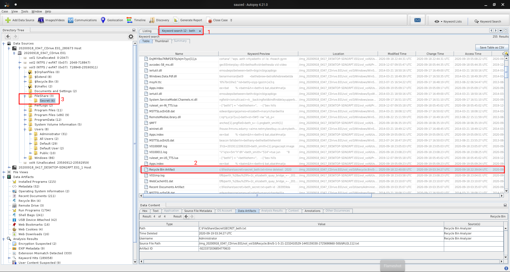

`Secret_Beth.txt` has been deleted and a file has been create for replacing.

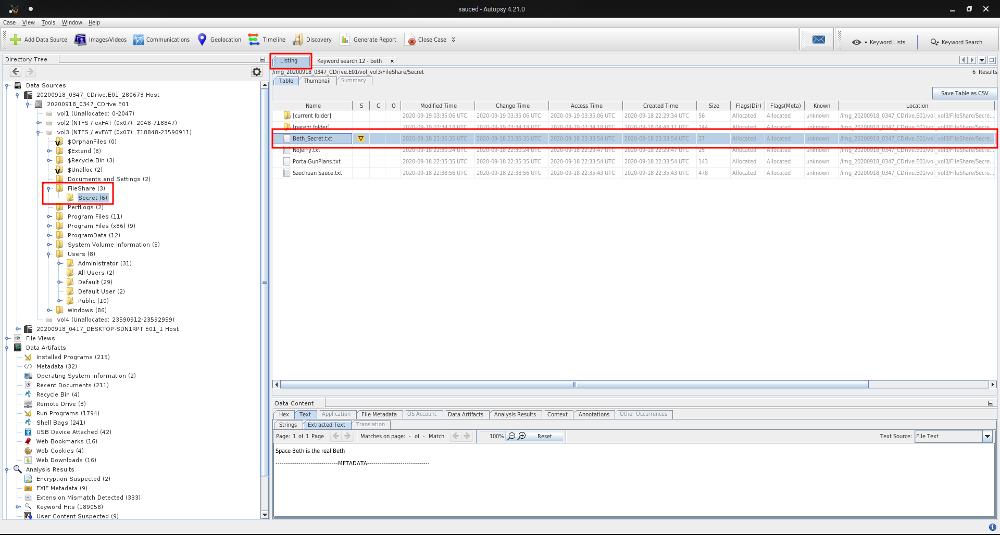

**Answer : Secret_Beth.txt**

### Q18 - What was the content of Beth’s secret file? (six words, spaces in between)

The location of deleted file is given.

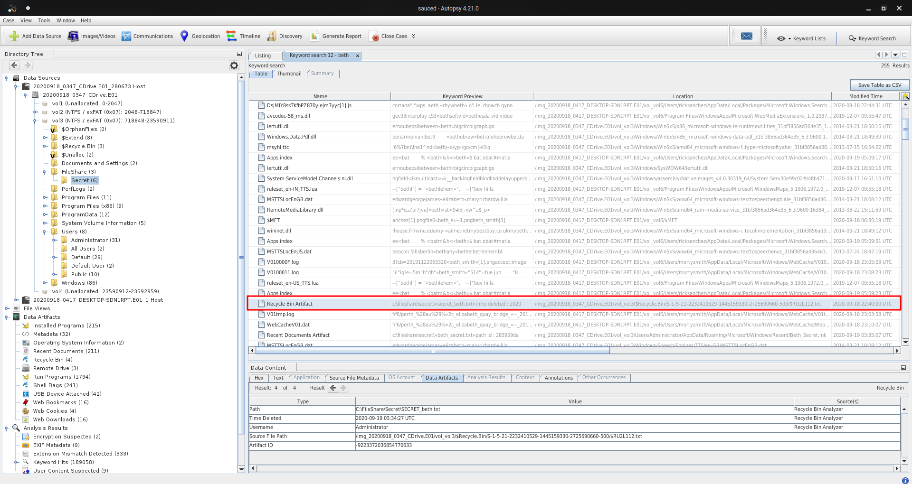

**Answer : Earth beth is the real beth**

### Q19 - The malware tried to obtain persistence in a similar way to how Carbanak malware obtains persistence. What is the corresponding MITRE technique ID?

Carbanak : https://attack.mitre.org/groups/G0008/

**Answer : T1543.003**