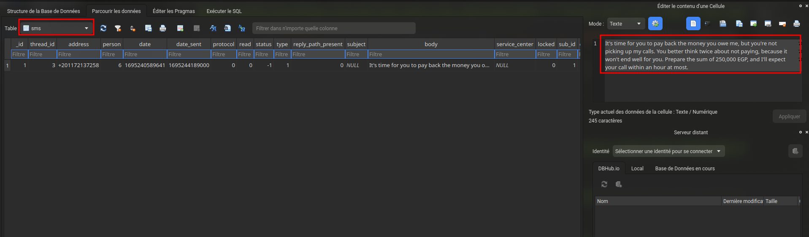
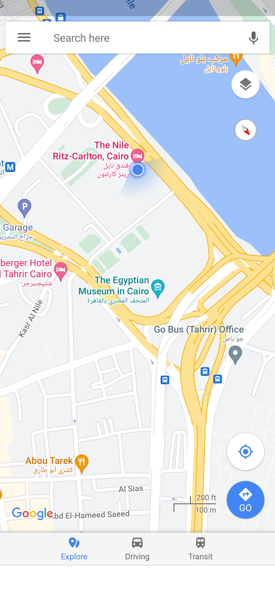
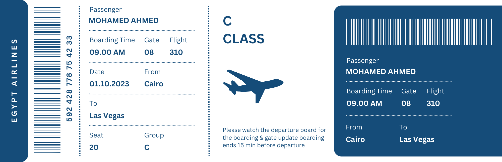

# The Crime

## Info

- Category : Endpoint Forensics
- SHA1SUM : 3eb40fd0257dd3bf7d7513e1423e54c8fced4706
- Published : Sept. 29, 2023, 4 p.m.
- Author : Infern0o
- Size : 330 MB
- Tags : Android ALEAPP sqlitebrowser
- Password : cyberdefenders.org

### Scenario

We're currently in the midst of a murder investigation, and we've obtained the victim's phone as a key piece of evidence. After conducting interviews with witnesses and those in the victim's inner circle, your objective is to meticulously analyze the information we've gathered and diligently trace the evidence to piece together the sequence of events leading up to the incident.

### Helpful Tools

- [ALEAPP](https://github.com/abrignoni/ALEAPP)
- sqlitebrowser

### Resources

- [Android-Forensics-References](https://github.com/RealityNet/Android-Forensics-References)

---

## Questions

### Q1 - Based on the accounts of the witnesses and individuals close to the victim, it has become clear that the victim was interested in trading. This has led him to invest all of his money and acquire debt. Can you identify which trading application the victim primarily used on his phone?

Installed application are under `/app/` folder :

```shell
ls data/app

'com.discord-KLUcW-znRrAEKSMAOtHViQ=='  'com.ticno.olymptrade-lKDfBXc8qLNF9F2eXSyBwg=='
```

**Answer : olymptrade**

### Q2 - According to the testimony of the victim's best friend, he said, "While we were together, my friend got several calls he avoided. He said he owed the caller a lot of money but couldn't repay now". How much does the victim owe this person?

SMS are stored in a DB `mmssms.db`. This DB is stored in package application folder `com.android.providers.telephony`. This application is found in the data folder or in the user space.

```shell
sqlitebrowser user_de/0/com.android.providers.telephony/databases/mmssms.db
```



**Answer : 250000**

### Q3 - What is the name of the person to whom the victim owes money?

We know that the send as this phone number`+201172137258`. We also know that the man calls a lot.

```shell
sqlite3 data/com.android.providers.contacts/databases/calllog.db "SELECT name, normalized_number FROM calls WHERE normalized_number='+201172137258'"

Shady Wahab|+201172137258
```

**Answer : Shady Wahab**

### Q4 - Based on the statement from the victim's family, they said that on September 20, 2023, he departed from his residence without informing anyone of his destination. Where was the victim located at that moment?

In certain cases (pressing the back button for example), a screenshot is automatically taken by the system, in order to make it easier for the user to return to the application later. So let's check application snapshot.

```
gwenview system_ce/0/snapshots/6.jpg
```



**Answer : The Nile Ritz-Carlton**

### Q5 - The detective continued his investigation by questioning the hotel lobby. She informed him that the victim had reserved the room for 10 days and had a flight scheduled thereafter. Where was the victim intend to travel?

```shell
ls media/0/Download 
'Plane Ticket.png'
```



**Answer : Las Vegas**

### Q6 - After examining the victim's Discord conversations, we discovered he had arranged to meet a friend at a specific location. Can you determine where this meeting was supposed to occur?

```shell
sqlitebrowser data/data/com.discord/files/kv-storage/@account.665825323065016370/a  
```

In discord, message are stored with the JSON format

```json
{
  "id": "1154156539620376576",
  "channelId": "1153848030269804606",
  "message": {
    "id": "1154156539620376576",
    "type": 0,
    "content": "What a wonderful news! We'll meet at **The Mob Museum**, I'll await your call when you arrive.\nEnjoy you flight bro ❤️",
    "channel_id": "1153848030269804606",
    "author": {
      "id": "740485289197436968",
      "username": "rob1ns0n.",
      "avatar": "bd09719d0fe80aee19cc6b054a28c7e5",
      "discriminator": "0",
      "flags": 0,
      "banner": null,
      "accent_color": null,
      "publicFlags": 0,
      "avatarDecorationData": null,
      "globalName": "0xR0b1n50N"
    },
    "attachments": [],
    "embeds": [],
    "mentions": [],
    "mention_roles": [],
    "pinned": false,
    "mention_everyone": false,
    "tts": false,
    "timestamp": "2023-09-20T20:46:02.237000+00:00",
    "edited_timestamp": null,
    "flags": 0,
    "components": [],
    "reactions": [
      {
        "emoji": {
          "id": null,
          "name": "❤️"
        },
        "count": 1,
        "count_details": {
          "burst": 0,
          "normal": 1
        },
        "burst_colors": [],
        "me_burst": false,
        "burst_me": false,
        "me": true,
        "burst_count": 0
      }
    ]
  },
  "members": [],
  "users": [
    {
      "id": "740485289197436968",
      "username": "rob1ns0n.",
      "discriminator": "0",
      "avatar": "bd09719d0fe80aee19cc6b054a28c7e5",
      "email": null,
      "verified": false,
      "bot": false,
      "system": false,
      "mfaEnabled": false,
      "mobile": false,
      "desktop": false,
      "flags": 0,
      "publicFlags": 0,
      "purchasedFlags": 0,
      "premiumUsageFlags": 0,
      "phone": null,
      "guildMemberAvatars": {},
      "hasBouncedEmail": false,
      "personalConnectionId": null,
      "globalName": "0xR0b1n50N",
      "avatarDecoration": null
    }
  ],
  "connectionId": 1695243767437
}
```

**Answer : The Mob Museum**
